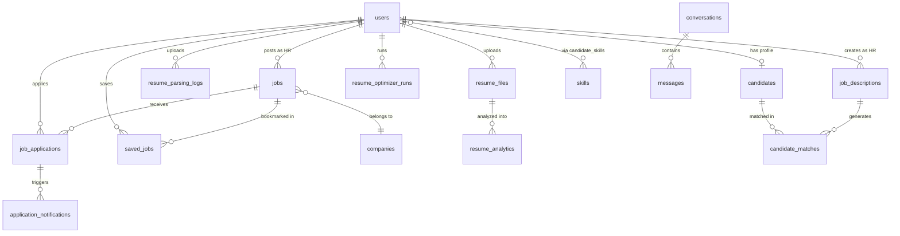
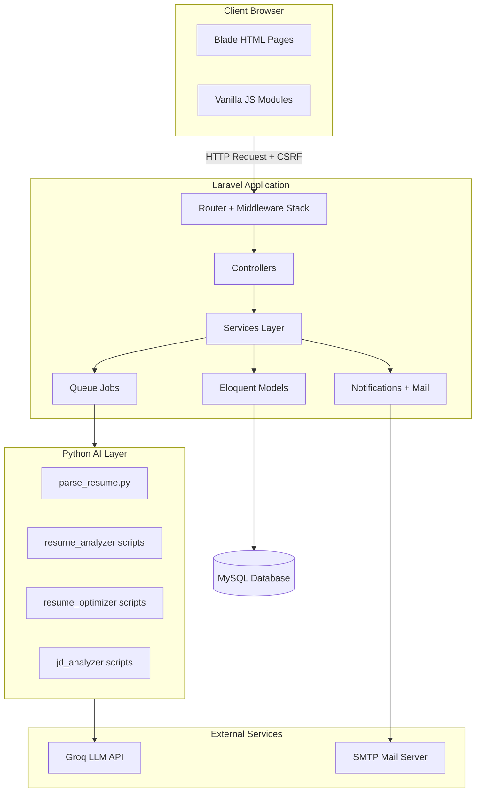
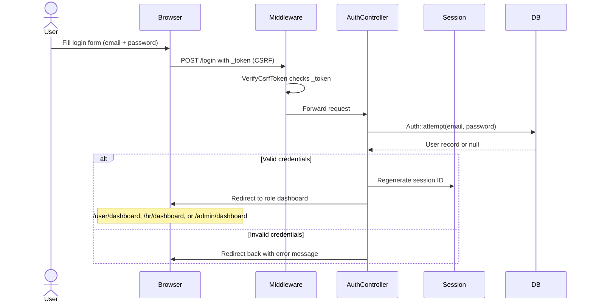
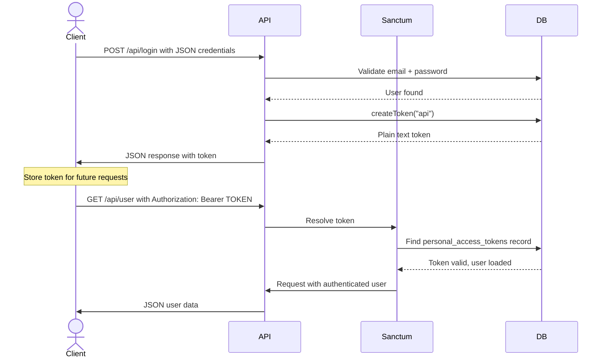
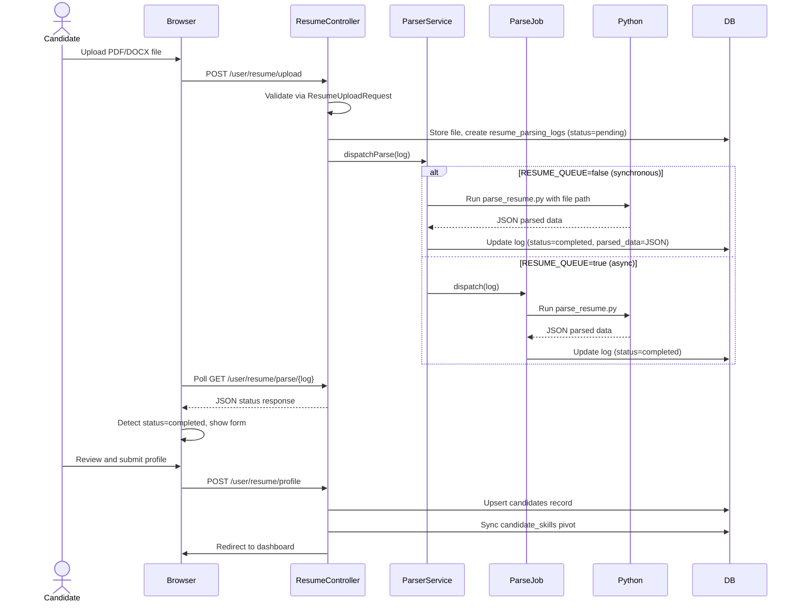
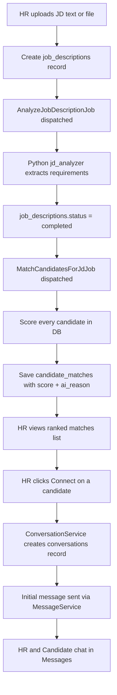
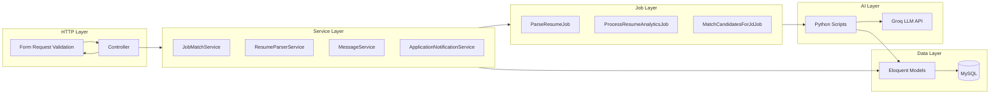

# TalentSync AI — Complete Academic Project Report

**Programme:** Master of Computer Applications (MCA)
**Project Title:** TalentSync AI
**Technology Stack:** Laravel 10, PHP 8.1+, MySQL, Python 3.10+, Blade, Tailwind CSS

---

## Table of Contents

- [Section 1 — Project Overview](#section-1)
- [Section 2 — Complete Feature Analysis](#section-2)
- [Section 3 — Database Analysis](#section-3)
- [Section 4 — System Design](#section-4)
- [Section 5 — API Documentation](#section-5)
- [Section 6 — User Manual](#section-6)
- [Section 7 — Testing Documentation](#section-7)
- [Section 8 — Security Analysis](#section-8)
- [Section 9 — Performance Analysis](#section-9)
- [Section 10 — Project File Structure](#section-10)
- [Section 11 — Dependency Analysis](#section-11)
- [Section 12 — Viva Questions and Answers](#section-12)
- [Section 13 — Future Enhancements](#section-13)
- [Section 14 — Project Summary](#section-14)

---

<a name="section-1"></a>
## SECTION 1 — PROJECT OVERVIEW

### 1.1 Project Title

**TalentSync AI**
An intelligent AI-powered recruitment and job-seeking web system built with Laravel 10, Python 3.10+, and MySQL.

---

### 1.2 Project Objective

To build an end-to-end AI-assisted recruitment platform that:

1. Automates resume parsing and structured candidate profile creation using Python.
2. Provides AI-powered resume analytics (scorecard, skill gaps, career growth) via LLM.
3. Optimises resumes for ATS systems and generates downloadable optimised PDFs.
4. Computes weighted job-candidate match scores (52–99%) with human-readable explanations.
5. Enables HR to automatically rank all candidates for a job description using AI.
6. Manages the full hiring workflow: apply → under review → shortlisted → interview → hired/rejected.
7. Provides threaded in-platform messaging between HR and shortlisted candidates.

---

### 1.3 Problem Statement

Traditional hiring processes face the following challenges:

**For Candidates:**
- They do not know how ATS (Applicant Tracking Systems) score their resume.
- They cannot identify skill gaps relative to a specific job description.
- There is no intelligent job recommendation based on their actual profile.

**For HR / Recruiters:**
- Manually reading hundreds of resumes is extremely time-consuming.
- Matching candidates to a new JD requires repetitive manual screening.
- Communication with candidates is scattered across email and phone.

**For Organisations:**
- No centralised tracking of application status across all open positions.
- No data-driven insights into the health of the hiring pipeline.
- Candidate pool data is underutilised when hiring for new roles.

---

### 1.4 Proposed Solution

| Problem | TalentSync AI Solution |
|---------|--------------------------|
| Candidates do not know their ATS score | AI Resume Optimizer analyses resume and generates ATS-ready version |
| Skill gaps are unclear | AI Analytics provides skill gap analysis and career growth advice |
| Manual job-candidate matching | JobMatchService computes weighted score across 5 dimensions |
| HR reads resumes manually | AI Hiring ranks all candidates for any uploaded JD automatically |
| Communication scattered | Built-in threaded messaging with unread badges |
| No status tracking | Application status pipeline with in-app notifications |
| Resume parsing is manual | Python scripts extract structured data from PDF/DOCX automatically |

---

### 1.5 Main Features

| # | Feature | Role | Description |
|---|---------|------|-------------|
| 1 | Web & API Authentication | All | Session login + Sanctum bearer tokens |
| 2 | Candidate Dashboard | Candidate | Applied count, saved count, match score, active applications |
| 3 | HR Dashboard | HR | Jobs posted, total applicants, recent applications |
| 4 | Admin Dashboard & Analytics | Admin | Platform-wide stats, charts, application oversight |
| 5 | Job Posting CRUD | HR | Create, edit, delete, publish, draft jobs |
| 6 | Job Recommendations | Candidate | Ranked job list with match % and match reasons |
| 7 | Job Application | Candidate | One-click apply; match score stored on application |
| 8 | Resume Upload & Parsing | Candidate / HR | Python PDF/DOCX extraction → auto-fill profile |
| 9 | AI Resume Analytics | Candidate | LLM scorecard: skills, gaps, education, recommendations |
| 10 | AI Resume Optimizer | Candidate / Guest | ATS analysis + downloadable optimised resume PDF |
| 11 | AI Hiring | HR | JD upload → auto-match ALL candidates → ranked list |
| 12 | Applicant Management | HR / Admin | View, filter, update status, download resume |
| 13 | Messaging | HR + Candidate | Threaded conversations, unread count badges, throttled |
| 14 | In-App Notifications | Candidate | Bell alerts on application status changes |
| 15 | Guest Tools | Guest (unauth) | 3 free resume test + ATS check attempts per session |
| 16 | Profile & Settings | All | Photo upload, password change, notification preferences |
| 17 | Saved / Applied Jobs | Candidate | Bookmark jobs; track application history |
| 18 | Password Reset | All | Email token-based password recovery |

---

### 1.6 Target Users

| User Type | Role Value | Who They Are | Primary Goals |
|-----------|-----------|--------------|---------------|
| Job Seeker / Candidate | `user` | Students and professionals seeking employment | Upload resume, find matching jobs, apply, track status |
| HR / Recruiter | `hr` | Hiring managers and recruiters | Post jobs, review applicants, use AI hiring |
| Administrator | `admin` | Platform owner / super user | Monitor analytics, manage all applications |
| Guest | (unauthenticated) | First-time visitors evaluating the platform | Try resume test and ATS check for free |

**Seeded Demo Accounts (after `php artisan db:seed`):**

| Role | Email | Password |
|------|-------|----------|
| Candidate | user@gmail.com | user@gmail.com |
| HR | hr@gmail.com | hr@gmail.com |
| Admin | admin@gmail.com | admin@gmail.com |

---

### 1.7 Technologies Used

| Layer | Technology | Version | Purpose |
|-------|-----------|---------|---------|
| Backend Framework | Laravel | 10.x | MVC, routing, Eloquent ORM, queues, mail |
| Backend Language | PHP | ^8.1 | Core server-side logic |
| Database | MySQL | 8.x | Relational persistent storage |
| AI / Document Layer | Python | 3.10+ | Resume parsing, analytics, optimisation |
| API Authentication | Laravel Sanctum | ^3.3 | Stateless bearer token auth for API |
| Frontend Templating | Laravel Blade | (bundled) | Server-rendered HTML views |
| CSS Framework | Tailwind CSS | CDN | Responsive utility-first styles |
| Frontend Scripts | Vanilla JavaScript | ES6 | Async fetch, polling, chat UI |
| Build Tool | Vite | ^5.0 | Asset bundling (minimal, entry point only) |
| HTTP Client | Guzzle | ^7.2 | PHP-based HTTP requests |
| LLM Provider | Groq API | latest | Resume and JD AI analysis (default) |
| Alternative LLM | OpenAI / Gemini | latest | Optional alternate AI providers |

**Important:** This project does NOT use Angular, React, or Vue. The UI is 100% server-rendered Laravel Blade with page-specific vanilla JavaScript modules in `public/js/`.

---

### 1.8 Frontend Technologies Detail

| Technology | Files | Role |
|-----------|-------|------|
| Laravel Blade | `resources/views/**/*.blade.php` | HTML page templates |
| Tailwind CSS | Loaded via CDN in layout files | Styling |
| Vanilla JS | `public/js/*.js` | Upload polling, chat, apply/save actions |
| Axios | `resources/js/bootstrap.js` | Available on `window.axios` |
| Vite | `vite.config.js` | Bundles `resources/js/app.js` only |
| Per-page Tailwind config | `public/js/tailwind-config-*.js` | Custom colours per page type |

---

### 1.9 Backend Technologies Detail

| Technology | Role |
|-----------|------|
| PHP 8.1+ | Core language; named arguments, match expressions, enums |
| Laravel 10 | Framework: routing, ORM, middleware, queues, events |
| Laravel Sanctum | API token creation, revocation, `auth:sanctum` guard |
| Eloquent ORM | Active Record; models, relationships, query builder |
| Laravel Jobs | Async queue jobs for slow Python operations |
| Python 3.10+ | Subprocess called from PHP for AI document tasks |
| pdfplumber / pypdf | PDF text extraction in `parse_resume.py` |
| python-docx | DOCX text extraction |
| PyMuPDF | Advanced PDF rendering for resume analyzer |
| openai SDK | Calls Groq / OpenAI LLM API from Python |
| google-generativeai | Calls Google Gemini from Python (optional) |

---

### 1.10 Database

**MySQL** is the primary relational database.
- Database name configured via `DB_DATABASE` (default: `ai_job` in `.env.example`)
- 17 application tables plus 4 Laravel system tables
- All interactions go through **Eloquent ORM** which uses PDO prepared statements — no raw SQL injection risk

---

### 1.11 Third-party APIs and Services

| Service | Purpose | Config Variables |
|---------|---------|-----------------|
| Groq API | Default LLM for resume/JD AI analysis | `GROQ_API_KEY`, `GROQ_MODEL`, `GROQ_BASE_URL` |
| OpenAI API | Alternative LLM provider | `OPENAI_API_KEY` |
| Google Gemini | Alternative LLM provider | `GEMINI_API_KEY` |
| Mailpit (dev) | Local email testing server | `MAIL_*` variables |
| AWS S3 (optional) | Cloud file storage | `AWS_ACCESS_KEY_ID`, `AWS_SECRET_ACCESS_KEY`, `AWS_BUCKET` |
| Pusher (optional) | Real-time broadcasting | `PUSHER_APP_KEY`, `PUSHER_APP_SECRET` |

---

### 1.12 Hosting and Deployment

**Local Development:**
```bash
php artisan serve        # Starts at http://127.0.0.1:8000
```

**Production Setup (inferred from SETUP docs):**

| Component | Configuration |
|-----------|--------------|
| Web Server | Apache or Nginx; DocumentRoot points to `public/` |
| PHP | PHP 8.1+ with php-fpm |
| Database | MySQL 8.x on local or remote server |
| Python | venv at `scripts/resume_analyzer/venv/` |
| Queue | `QUEUE_CONNECTION=database` + `php artisan queue:work` (via supervisor) |
| File Storage | `RESUME_DISK=public` + `php artisan storage:link` |
| AI Features | Set real `GROQ_API_KEY` in `.env` |

OS setup guides: `SETUP-WINDOWS.md`, `SETUP-UBUNTU.md`. No Docker or cloud IaC is provided.

---

### 1.13 Project Workflow Summary

1. A visitor arrives at `/` (landing page). They can optionally try **Guest Tools** — resume parsing test or ATS check — up to 3 times per session.
2. The visitor **registers** as a Candidate (`role=user`) or HR (`role=hr`). Admin accounts are seeded only and cannot self-register.
3. A **Candidate** uploads their resume (PDF/DOCX/TXT). Python parses it into structured JSON. The user previews the extracted data, edits if needed, and clicks **Create Profile**. This creates or updates the `candidates` record and syncs skills via the `candidate_skills` pivot table.
4. Optionally, the candidate runs **AI Resume Analytics** (Groq LLM generates a full scorecard stored in `resume_analytics`) and uses the **AI Resume Optimizer** (ATS analysis + downloadable optimised PDF stored in `resume_optimizer_runs`).
5. An **HR** user creates job postings with title, skills, experience requirements, salary, and screening questions. Jobs start as draft (inactive) until published.
6. Candidates visit **Job Recommendations** and see ranked jobs. The match score is computed by `JobMatchService` using 5 weighted factors: skills (35%), projects (25%), experience (15%), keywords (15%), education (10%). Scores range from 52 to 99.
7. Candidates **apply** to active jobs. The match score is stored on the `job_applications` record. Duplicate applications are blocked.
8. **HR** reviews applicants, updates status through the pipeline (applied → under_review → shortlisted → interview_scheduled → hired / rejected). Candidates receive in-app notifications on status changes.
9. **HR** can also use **AI Hiring**: upload a JD (text or file) → system analyzes it → ranks ALL registered candidates by match score → HR views the ranked list → clicks **Connect** to start a conversation.
10. **Admin** monitors the full hiring pipeline via the analytics dashboard and can manage all applications across all HR accounts.

---

---

<a name="section-2"></a>
## SECTION 2 — COMPLETE FEATURE ANALYSIS

---

### Module 1: Authentication

**Purpose:** Secures all routes and provides identity to the system. Supports both web sessions (Blade UI) and API tokens (Sanctum) for potential mobile/SPA clients.

**Input:**
- Web login: email, password, remember_me checkbox, CSRF token
- Web register: name, email, password, password_confirmation, role (user/hr)
- API login: JSON body `{ "email": "...", "password": "..." }`

**Process:**
1. `AuthController@login` calls `Auth::attempt(['email', 'password'])`.
2. On success, session is regenerated (`$request->session()->regenerate()`).
3. `AuthRedirect::dashboardFor($user)` reads `users.role` and redirects to the correct dashboard.
4. API login in `Api\AuthController@login` returns `{ token: "..." }` via `$user->createToken('api')->plainTextToken`.

**Output:**
- Web: Redirect to `/user/dashboard`, `/hr/dashboard`, or `/admin/dashboard`
- API: JSON `{ "token": "...", "user": {...} }`
- Failure: Redirect back with error "These credentials do not match our records."

**Database Tables Used:** `users`, `personal_access_tokens`

**Backend Logic Files:**
- `app/Http/Controllers/AuthController.php` — web login/register/logout/password reset
- `app/Http/Controllers/Api/AuthController.php` — API token login/register/logout
- `app/Support/AuthRedirect.php` — role-to-dashboard mapping

**Frontend Components:**
- `resources/views/auth/login.blade.php`
- `resources/views/auth/register.blade.php`
- `resources/views/auth/forgot-password.blade.php`
- `resources/views/auth/reset-password.blade.php`

**Validation Rules:**

| Field | Rule |
|-------|------|
| email | required, valid email format |
| password (login) | required |
| name (register) | required, string, max 255 |
| email (register) | required, email, unique in users table |
| password (register) | required, min 8, confirmed (must match password_confirmation) |
| role (register) | required, must be "user" or "hr" only |

**Security Notes:**
- Passwords hashed with bcrypt via `Hash::make()`
- CSRF token verified on every POST
- Sessions regenerated on login to prevent session fixation
- Password and password_confirmation never flashed to session (listed in `Handler::$dontFlash`)

---

### Module 2: Candidate Dashboard

**Purpose:** Gives the logged-in candidate a quick overview of their job search activity and AI score.

**Input:** Authenticated session (no form input; all data is auto-loaded from DB).

**Process:**
`DashboardController@user()` queries:
- `user->jobApplications()->count()` — total applications
- `user->savedJobRecords()->count()` — total saved jobs
- `user->applicationNotifications()->where('is_read', false)->count()` — unread notifications
- `candidate->ai_score` — AI score from resume analytics
- Applications NOT in rejected/hired status → active application count

**Output:** Blade view `dashboards/user.blade.php` with stats cards.

**Database Tables Used:** `users`, `candidates`, `job_applications`, `saved_jobs`, `application_notifications`

**Backend Logic:** `app/Http/Controllers/DashboardController.php` (method `user()`)

**Frontend:** `resources/views/dashboards/user.blade.php`, layout `resources/views/layouts/candidate.blade.php`

---

### Module 3: HR Dashboard

**Purpose:** Gives HR users an overview of their posted jobs and recent applicant activity.

**Process:**
`DashboardController@hr()` queries:
- All jobs for this HR user with `withCount('applications')`
- Active jobs count, draft jobs count, total applicants sum
- Last 5 applications across all HR jobs with candidate and job details

**Output:** Blade view `dashboards/hr.blade.php` with job list and recent applicants table.

**Database Tables Used:** `users`, `jobs`, `job_applications`, `candidates`

**Backend Logic:** `app/Http/Controllers/DashboardController.php` (method `hr()`)

---

### Module 4: Admin Dashboard and Analytics

**Purpose:** Platform-wide oversight and data-driven insights for the platform owner.

**Process:**
- `DashboardController@admin()` counts total users, HR users, jobs (total and active), all applications.
- `AnalyticsController@adminData()` returns JSON with time-series data for charts.
- `PageController@adminAnalytics()` renders the analytics dashboard page.

**Output:**
- Stats cards on `/admin/dashboard`
- Chart data fetched asynchronously at `GET /admin/analytics/data`

**Database Tables Used:** `users`, `jobs`, `job_applications`

**Backend Logic:**
- `app/Http/Controllers/DashboardController.php` (method `admin()`)
- `app/Http/Controllers/Api/AnalyticsController.php` (method `adminData()`)

**Frontend:** `resources/views/dashboards/admin.blade.php`, `resources/views/pages/admin_analytics_dashboard.blade.php`, `public/js/admin-applications.js`

---

### Module 5: Job Posting CRUD

**Purpose:** Allows HR users to create, publish, edit, and delete job listings.

**Input:**
- Title, company name, location, job type (Full-time/Part-time/Contract/Freelance)
- Experience required, skills (comma-separated), description, responsibilities, requirements
- Work mode (Remote/Hybrid/On-site), salary range (min/max, currency)
- Application deadline, number of openings, status (active/inactive)
- Screening questions (Q1, Q2, Q3), qualifications

**Process:**
`JobController@store()` / `update()`:
1. Normalises skills string (trims, deduplicates).
2. Validates using inline `$request->validate($this->jobRules())`.
3. Creates `Job` with `hr_id = auth()->id()`.
4. If status = active, displays "Job posted successfully." If inactive, "Job saved as draft."

`JobController@toggleStatus()` — flips active ↔ inactive via PATCH request.
`JobController@destroy()` — deletes the job (only if owned by this HR, checked by `authorizeJob()`).

**Output:** Redirect to `/hr/dashboard` with flash success message.

**Database Tables Used:** `jobs`, `companies` (optional)

**Backend Logic:** `app/Http/Controllers/JobController.php`

**Frontend:**
- `resources/views/pages/post_a_job.blade.php` (multi-step form)
- `public/js/hr-ai-hiring.js` for status toggle

**Validation Rules (key fields):**

| Field | Rule |
|-------|------|
| title | required, string, max 255 |
| location | required, string, max 255 |
| job_type | required, in: Full-time, Part-time, Contract, Freelance, Internship |
| description | required, string |
| skills_required | nullable, string |
| min_salary | nullable, numeric, min 0 |
| max_salary | nullable, numeric, min 0 |
| application_deadline | nullable, date, after today |
| status | required, in: active, inactive |

---

### Module 6: Job Application

**Purpose:** Allows candidates to apply to active jobs. Records the match score at time of application and tracks the full hiring pipeline.

**Input:** Authenticated candidate session; `POST /user/jobs/{job}/apply` (no form body beyond CSRF).

**Process:**
`UserJobController@apply()`:
1. `abort_unless($job->status === Job::STATUS_ACTIVE, 404)` — blocks applying to drafts.
2. Checks for duplicate application (unique constraint on user_id + job_id).
3. Builds candidate profile via `CandidateProfileBuilder::forUser()`.
4. Computes `JobMatchService::percentage()` for this job-candidate pair.
5. Creates `JobApplication` with status `applied`, `match_score`, `applied_at = now()`.
6. Returns JSON `{ success: true, message: "..." }`.

**Status Lifecycle:**

| Status | Label | Set By |
|--------|-------|--------|
| `applied` | Applied | System (on apply) |
| `under_review` | Under Review | HR / Admin |
| `shortlisted` | Shortlisted | HR / Admin |
| `interview_scheduled` | Interview Scheduled | HR / Admin |
| `rejected` | Rejected | HR / Admin |
| `hired` | Hired | HR / Admin |

**Status change triggers** `ApplicationNotificationService::notifyStatusChange()` which creates an `application_notifications` record.

**Database Tables Used:** `job_applications`, `jobs`, `candidates`, `application_notifications`

**Backend Logic:**
- `app/Http/Controllers/UserJobController.php`
- `app/Services/JobMatchService.php`
- `app/Services/ApplicationNotificationService.php`

**Frontend:** `public/js/job-details.js` — handles the Apply and Save button clicks via fetch()

**Match Score Algorithm:**
```
score = (skillsScore * 0.35)
      + (projectsScore * 0.25)
      + (experienceScore * 0.15)
      + (keywordsScore * 0.15)
      + (educationScore * 0.10)

final = clamp(round(52 + (score * 47)), 52, 99)
```

Skills are normalized (lowercase, trimmed), then compared by exact match and substring match. Projects text is scanned for technology keywords. Experience years are compared numerically.

---

### Module 7: Resume Upload and Parsing

**Purpose:** Extracts structured candidate profile data from uploaded PDF/DOCX/TXT files using Python, eliminating the need for manual data entry.

**Input:** Resume file (PDF, DOCX, or TXT), max 10MB (configurable via `RESUME_MAX_UPLOAD_KB`)

**Process:**
1. `ResumeController@upload()` validates file via `ResumeUploadRequest`.
2. File is stored on the configured disk (`RESUME_DISK`, default local).
3. `ResumeParsingLog` record is created with `parsing_status = pending`.
4. `ResumeParserService::dispatchParse()` either runs synchronously or dispatches `ParseResumeJob`.
5. Python `scripts/parse_resume.py` extracts text and structured JSON fields.
6. Log is updated with `parsed_data` JSON and `parsing_status = completed` (or `failed`).
7. Frontend polls `GET /user/resume/parse/{log}` until status is not `pending`.
8. Parsed fields are shown in a confirmation form.
9. `POST /user/resume/profile` → `StoreCandidateProfileRequest` validates → `CreateCandidateProfileAction` upserts `candidates` record → `SyncCandidateSkillsAction` updates `candidate_skills` pivot.

**Output:** Candidate profile row in `candidates` table; skills in `candidate_skills` pivot.

**Database Tables Used:** `resume_parsing_logs`, `candidates`, `candidate_skills`, `skills`

**Backend Logic:**
- `app/Http/Controllers/ResumeController.php`
- `app/Services/ResumeParserService.php`
- `app/Jobs/ParseResumeJob.php`
- `app/Actions/CreateCandidateProfileAction.php`
- `app/Actions/SyncCandidateSkillsAction.php`
- `scripts/parse_resume.py`

**Frontend:** `public/js/resume-upload.js` — polls status endpoint, shows progress, renders confirmation form.

**Validation Rules:**

| Field | Rule |
|-------|------|
| resume file | required, file, max KB from config, mimes: pdf, docx, txt |
| full_name (on profile confirm) | required, string, max 255 |
| email | required, email, max 255 |
| experience_years | nullable, integer, min 0, max 50 |
| graduation_year | nullable, integer, min 1950, max current year + 1 |
| skills | nullable, array |

---

### Module 8: AI Resume Analytics

**Purpose:** Provides a deep AI-generated analysis of the candidate resume including score, skill gaps, career growth, soft skills, and improvement recommendations.

**Input:** Resume file (PDF/DOCX), uploaded to `resume_files` table (separate from parsing flow).

**Process:**
1. `UserResumeController@uploadResume()` validates file, stores it, creates `Resume` record in `resume_files`.
2. `ProcessResumeAnalyticsJob` dispatches, calling `PythonResumeAnalyzerService::analyze()`.
3. Python `scripts/resume_analyzer/` script extracts text and calls Groq/OpenAI/Gemini LLM.
4. LLM returns structured JSON with: ai_score, skills list, missing_skills, skill_gap_analysis, career_growth, education, nlp_analysis, soft_skills, ai_profile_summary, resume_improvements, job_recommendations, strengths, weaknesses.
5. `ResumeAnalytics` record is created/updated linked to the resume file.

**Output:** Analytics dashboard at `GET /user/resume/analytics` powered by `resume_analytics` data.

**Database Tables Used:** `resume_files`, `resume_analytics`

**Backend Logic:**
- `app/Http/Controllers/UserResumeController.php`
- `app/Services/PythonResumeAnalyzerService.php`
- `app/Jobs/ProcessResumeAnalyticsJob.php`
- `scripts/resume_analyzer/`

**Frontend:** `resources/views/pages/resume_analytics_dashboard.blade.php`

**Key Analytics Fields Stored:**

| Field | Type | Description |
|-------|------|-------------|
| ai_score | integer | Overall resume score 0–100 |
| skills | array (JSON) | Detected skills list |
| missing_skills | array (JSON) | Skills absent from resume |
| skill_gap_analysis | array (JSON) | Gap vs target role |
| career_growth | array (JSON) | Growth trajectory analysis |
| soft_skills | array (JSON) | Communication, leadership, etc. |
| resume_improvements | array (JSON) | Specific improvement suggestions |
| job_recommendations | array (JSON) | Recommended job titles |
| strengths | array (JSON) | Key resume strengths |
| weaknesses | array (JSON) | Key resume weaknesses |

---

### Module 9: AI Resume Optimizer

**Purpose:** Analyses a resume against ATS rules, identifies issues, and generates a new optimised resume PDF that candidates can download.

**Input:** Resume file (PDF/DOC/DOCX), max 10MB.

**Process (two-phase pipeline):**

**Phase 1 — Analyze:**
1. `ResumeOptimizerController@upload()` stores file, creates `ResumeOptimizerRun` with `status = pending`.
2. `AnalyzeResumeOptimizerJob` runs `PythonResumeOptimizerService::analyze()`.
3. Python script extracts text and calls LLM to produce `analysis_result` JSON (ATS score, issues, suggestions).
4. Run status updated to `analyzed`.

**Phase 2 — Generate:**
1. Candidate clicks "Generate Optimised Resume" → `POST /user/resume/ai-optimizer/generate`.
2. `GenerateOptimizedResumeJob` runs `PythonResumeOptimizerService::generate()`.
3. Python uses `fast_builder.py` to create optimised PDF at `storage/resumes/optimized/`.
4. Run status updated to `completed`; `generated_file_path` stored.

**Run Status States:** `pending` → `analyzing` → `analyzed` → `generating` → `completed` / `failed`

**Output:** Downloadable optimised resume PDF at `GET /user/resume/ai-optimizer/download/{run}`.

**Guest Access:** Guests (unauthenticated) can use ATS check via `/tools/guest/ats-check/upload` limited to 3 attempts (tracked by `guest_session_id` in session, enforced by `EnsureGuestToolLimit` middleware).

**Database Tables Used:** `resume_optimizer_runs`

**Backend Logic:**
- `app/Http/Controllers/ResumeOptimizerController.php`
- `app/Services/PythonResumeOptimizerService.php`
- `app/Jobs/AnalyzeResumeOptimizerJob.php`
- `app/Jobs/GenerateOptimizedResumeJob.php`
- `scripts/resume_optimizer/optimizer.py`
- `scripts/resume_optimizer/fast_builder.py`

**Frontend:** `public/js/resume-ai-optimizer.js` — polls status, shows ATS results, triggers generate, enables download.

---

### Module 10: AI Hiring (HR Feature)

**Purpose:** Allows HR to upload a job description (text or file) and automatically receive a ranked list of all registered candidates matched by AI.

**Input:** JD title (optional), JD text OR JD file (PDF/DOCX/TXT), max 10MB.

**Process:**
1. `AiHiringController@store()` receives `StoreJobDescriptionRequest` (requires jd_text OR jd_file).
2. `JobDescriptionService::create()` creates `JobDescription` record with `status = pending`.
3. `AnalyzeJobDescriptionJob` dispatches → `PythonJdAnalyzerService::analyzeFile()` or `analyzeText()` extracts requirements.
4. `MatchCandidatesForJdJob` dispatches → `JdCandidateMatchService::matchAll()` scores every candidate in the DB.
5. `CandidateMatch` records are created with `match_score` and `ai_reason` for each candidate.
6. HR views ranked matches at `GET /hr/ai-hiring/{jobDescription}/matches`.
7. HR clicks **Connect** → `ConversationService::findOrCreate()` creates `conversations` + initial message.

**Output:**
- Ranked candidate list with match score and AI reasoning
- Conversation created with candidate on Connect

**Database Tables Used:** `job_descriptions`, `candidate_matches`, `conversations`, `messages`, `candidates`

**Backend Logic:**
- `app/Http/Controllers/Hr/AiHiringController.php`
- `app/Services/JobDescriptionService.php`
- `app/Services/JdCandidateMatchService.php`
- `app/Services/PythonJdAnalyzerService.php`
- `app/Services/ConversationService.php`
- `app/Jobs/AnalyzeJobDescriptionJob.php`
- `app/Jobs/MatchCandidatesForJdJob.php`

**Frontend:** `public/js/hr-ai-hiring.js` — polls JD analysis status, renders match cards, connect button.

**Validation (`StoreJobDescriptionRequest`):**
- `jd_text` OR `jd_file` must be present (custom `after` validator)
- `jd_file`: max KB from config, mimes pdf/docx/txt
- `jd_text`: max 50,000 characters

---

### Module 11: Messaging

**Purpose:** Enables real-time-style threaded conversations between HR and candidates, primarily triggered by AI Hiring connect actions.

**Input:**
- `POST /user/messages/{conversation}` or `POST /hr/messages/{conversation}` with `{ "body": "..." }`
- `GET /*/messages/{conversation}/list` — fetch new messages since a given ID

**Process:**
1. `MessageService::send()` creates a `Message` record with `sender_id`, `conversation_id`, `body`.
2. `conversation.last_message_at` is updated.
3. `ConversationService::authorizeParticipant()` enforces that only the HR or candidate in that conversation can read/send.
4. Unread count: `messages` with `read_at = null` for the other party.
5. `MessageService::markRead()` sets `read_at = now()` on unread messages.

**Throttle:** POST to message endpoint is throttled at 30 messages/minute per user (defined in route middleware `throttle:30,1`).

**Output:** JSON `{ message: {...}, conversation: {...} }` on send; JSON array on list fetch.

**Database Tables Used:** `conversations`, `messages`, `users`

**Backend Logic:**
- `app/Http/Controllers/Hr/HrMessageController.php`
- `app/Http/Controllers/UserMessageController.php`
- `app/Services/MessageService.php`
- `app/Services/ConversationService.php`

**Frontend:**
- `public/js/hr-messages.js`, `public/js/user-messages.js` — polling for new messages, send, mark read
- `public/js/hr-messages-badge.js`, `public/js/user-messages-badge.js` — unread count in nav badge
- `resources/views/pages/user/messages/index.blade.php`
- `resources/views/pages/hr/messages/show.blade.php`

**Validation:** `body` — required, string, min 1, max 5000 characters

---

### Module 12: In-App Notifications

**Purpose:** Notifies candidates whenever their application status changes (e.g., shortlisted, rejected, hired).

**Process:**
1. HR or Admin calls status update on a `JobApplication`.
2. `ApplicationNotificationService::notifyStatusChange()` creates an `ApplicationNotification` record.
3. Candidate sees an unread bell count in the top navigation bar.
4. `GET /user/notifications` lists all notifications.
5. `POST /user/notifications/read` marks all as read.

**Output:** In-app notification bell with unread count; notification list page.

**Database Tables Used:** `application_notifications`, `job_applications`, `users`

**Backend Logic:**
- `app/Services/ApplicationNotificationService.php`
- `app/Http/Controllers/UserNotificationController.php`

**Frontend:** `public/js/candidate-topbar.js` — polls unread notification count.

---

### Module 13: Guest Tools

**Purpose:** Lets unauthenticated visitors try resume parsing and ATS check for free, acting as a conversion funnel towards registration.

**Limits:** Maximum 3 attempts per tool per session, tracked by `guest_session_id` UUID stored in session.

**Tools Available:**
1. **Resume Test** — same parsing pipeline as the main resume upload; result shown inline
2. **ATS Check** — same as AI Optimizer analyze phase; shows ATS score and issues

**Process:**
1. `EnsureGuestToolLimit` middleware checks `GuestToolAttemptService::isLocked()`.
2. If locked (3 attempts used), redirect with "limit reached" message.
3. Otherwise, `GuestToolAttemptService::increment()` increments the session counter.
4. File is processed with `user_id = null` and `guest_session_id` set.

**Output:** Parsed resume data or ATS analysis rendered on the guest tools page.

**Database Tables Used:** `resume_parsing_logs` (nullable user_id), `resume_optimizer_runs` (nullable user_id)

**Backend Logic:**
- `app/Http/Controllers/GuestToolsController.php`
- `app/Services/GuestToolAttemptService.php`
- `app/Http/Middleware/EnsureGuestToolLimit.php`

**Frontend:** `public/js/guest-tools.js` — manages polling and results rendering.

---

### Module 14: Profile and Settings

**Purpose:** Allows all users to update their personal information, change password, upload a profile photo, and configure notification preferences.

**Input:**
- Profile update: name, email, phone, and role-specific fields (candidates also update full_name, location, current_title, experience_years, etc.)
- Password change: current_password, new password, password_confirmation
- Photo: JPG/PNG/WebP image, max 2MB
- Notification settings: JSON toggles (e.g., application_updates, new_messages)

**Process:**
- `ProfileController@update()` uses `UpdateProfileRequest` (email unique rule ignores current user).
- `ProfileController@updatePassword()` uses `UpdateProfilePasswordRequest` (Laravel's `current_password` rule).
- `ProfileController@updatePhoto()` stores image in `storage/app/public/photos/`, updates `users.profile_photo_path`.
- `ProfileController@removePhoto()` deletes file and nulls path.
- `NotificationSettingsController` saves JSON preferences to `users.notification_settings`.

**Output:** Redirect back with flash success message.

**Database Tables Used:** `users`, `candidates`

**Backend Logic:** `app/Http/Controllers/ProfileController.php`, `app/Http/Controllers/NotificationSettingsController.php`

**Frontend:**
- `resources/views/pages/profile/candidate.blade.php`
- `resources/views/pages/profile/employer.blade.php`
- `resources/views/pages/profile/admin.blade.php`
- `resources/views/partials/profile/settings-form.blade.php`

**Validation Rules:**

| Field | Rule |
|-------|------|
| name | required, string, max 120 |
| email | required, email, max 255, unique (ignoring current user) |
| phone | nullable, string, max 30 |
| current_password | required, must match stored hash (current_password rule) |
| new password | required, min 8, confirmed |
| photo | required (for upload), image, mimes jpg/jpeg/png/webp, max 2048 KB |

---

---

<a name="section-3"></a>
## SECTION 3 — DATABASE ANALYSIS

### 3.1 All Tables Overview

| # | Table Name | Model Class | Purpose |
|---|-----------|-------------|---------|
| 1 | `users` | `User` | All accounts (candidates, HR, admins) |
| 2 | `candidates` | `Candidate` | Extended profile for candidates (1:1 with users) |
| 3 | `companies` | `Company` | Company metadata linked to jobs |
| 4 | `jobs` | `Job` | Job postings by HR users |
| 5 | `job_applications` | `JobApplication` | Applications by candidates to jobs |
| 6 | `saved_jobs` | `SavedJob` | Bookmarked jobs by candidates |
| 7 | `skills` | `Skill` | Master list of skills |
| 8 | `candidate_skills` | (pivot) | Many-to-many: users ↔ skills |
| 9 | `resume_parsing_logs` | `ResumeParsingLog` | Resume parse job status and results |
| 10 | `resume_files` | `Resume` | Resume files uploaded for AI analytics |
| 11 | `resume_analytics` | `ResumeAnalytics` | AI-generated analytics per resume file |
| 12 | `resume_optimizer_runs` | `ResumeOptimizerRun` | AI optimizer pipeline state |
| 13 | `job_descriptions` | `JobDescription` | HR-uploaded JDs for AI hiring |
| 14 | `candidate_matches` | `CandidateMatch` | JD ↔ candidate match scores |
| 15 | `conversations` | `Conversation` | HR–candidate message threads |
| 16 | `messages` | `Message` | Individual chat messages |
| 17 | `application_notifications` | `ApplicationNotification` | In-app alerts for candidates |
| 18 | `personal_access_tokens` | (Sanctum) | API bearer tokens |
| 19 | `notifications` | (Laravel) | Database notification channel |
| 20 | `password_reset_tokens` | (Laravel) | Password reset tokens |
| 21 | `failed_jobs` | (Laravel) | Failed queue job records |

---

### 3.2 Table Schemas

#### Table: `users`
| Column | Type | Constraints | Description |
|--------|------|-------------|-------------|
| id | bigint | PK, auto-increment | Primary key |
| name | varchar(255) | NOT NULL | Display name |
| email | varchar(255) | UNIQUE, NOT NULL | Login email |
| email_verified_at | timestamp | NULL | Email verification timestamp |
| password | varchar(255) | NOT NULL | Bcrypt hashed password |
| role | varchar(20) | NOT NULL, default=user | user / hr / admin |
| phone | varchar(50) | NULL | Phone number |
| profile_photo_path | varchar(255) | NULL | Relative path to photo |
| notification_settings | json | NULL | JSON notification preferences |
| remember_token | varchar(100) | NULL | Remember me token |
| created_at / updated_at | timestamp | NULL | Timestamps |

#### Table: `candidates`
| Column | Type | Constraints | Description |
|--------|------|-------------|-------------|
| id | bigint | PK | Primary key |
| user_id | bigint | FK → users, NULL ON DELETE | Owning user |
| candidate_code | varchar(255) | NULL | Internal reference code |
| full_name | varchar(255) | NULL | Full legal name |
| email | varchar(255) | NULL | Contact email |
| phone | varchar(50) | NULL | Phone |
| location | varchar(255) | NULL | City / country |
| current_title | varchar(255) | NULL | Current job title |
| experience_years | integer | NULL | Total years of experience |
| seniority_level | varchar(100) | NULL | Junior / Mid / Senior |
| previous_companies | text | NULL | Past employer list |
| education | varchar(255) | NULL | Highest degree |
| university | varchar(255) | NULL | University name |
| graduation_year | integer | NULL | Graduation year |
| skills | json | NULL | Skill array from last parse |
| projects | json | NULL | Project descriptions |
| resume_path | varchar(255) | NULL | Latest uploaded resume path |
| summary | text | NULL | Professional summary |
| ai_recommendation | text | NULL | AI-generated recommendation |
| ai_score | integer | NULL | Overall AI resume score |

#### Table: `companies`
| Column | Type | Constraints | Description |
|--------|------|-------------|-------------|
| id | bigint | PK | Primary key |
| name | varchar(255) | NOT NULL | Company name |
| slug | varchar(255) | UNIQUE | URL slug |
| logo | varchar(255) | NULL | Logo file path |
| description | text | NULL | Company description |
| industry | varchar(255) | NULL | Industry sector |
| company_size | varchar(100) | NULL | e.g. 50–200 employees |
| founded | integer | NULL | Year founded |

#### Table: `jobs`
| Column | Type | Constraints | Description |
|--------|------|-------------|-------------|
| id | bigint | PK | Primary key |
| hr_id | bigint | FK → users CASCADE | Owning HR user |
| company_id | bigint | FK → companies NULL ON DELETE | Optional company |
| title | varchar(255) | NOT NULL | Job title |
| slug | varchar(255) | NULL | URL slug |
| company_name | varchar(255) | NULL | Displayed company name |
| location | varchar(255) | NULL | Job location |
| job_type | varchar(100) | NULL | Full-time, Part-time, etc. |
| work_mode | varchar(100) | NULL | Remote, Hybrid, On-site |
| experience_required | varchar(100) | NULL | e.g. "3+ years" |
| description | text | NULL | Job description |
| responsibilities | text | NULL | Responsibility list |
| requirements | text | NULL | Requirement list |
| benefits | text | NULL | Benefits list |
| skills_required | text | NULL | Comma-separated skills |
| screening_question_1/2/3 | text | NULL | Custom screening questions |
| minimum_qualification | text | NULL | Education requirement |
| preferred_qualification | text | NULL | Preferred education |
| min_salary | decimal | NULL | Minimum salary |
| max_salary | decimal | NULL | Maximum salary |
| salary | varchar(255) | NULL | Display salary string |
| currency | varchar(10) | NULL | Currency code |
| application_deadline | date | NULL | Closing date |
| number_of_openings | integer | NULL | Number of vacancies |
| status | varchar(20) | NOT NULL, default=inactive | active / inactive |

#### Table: `job_applications`
| Column | Type | Constraints | Description |
|--------|------|-------------|-------------|
| id | bigint | PK | Primary key |
| user_id | bigint | FK → users CASCADE | Applying candidate |
| job_id | bigint | FK → jobs CASCADE | Target job |
| status | varchar(50) | NOT NULL, default=applied | Application status |
| match_score | integer | NULL | Computed match % at apply time |
| applied_at | timestamp | NULL | Application timestamp |
| UNIQUE | (user_id, job_id) | | One application per job per user |

#### Table: `saved_jobs`
| Column | Type | Constraints | Description |
|--------|------|-------------|-------------|
| id | bigint | PK | Primary key |
| user_id | bigint | FK → users CASCADE | User who saved |
| job_id | bigint | FK → jobs CASCADE | Saved job |
| UNIQUE | (user_id, job_id) | | One bookmark per job per user |

#### Table: `skills`
| Column | Type | Description |
|--------|------|-------------|
| id | bigint PK | Primary key |
| name | varchar(255) | Skill name (e.g. PHP, Laravel) |
| slug | varchar(255) UNIQUE | URL-friendly identifier |

#### Table: `candidate_skills` (pivot)
| Column | Type | Constraints |
|--------|------|-------------|
| user_id | bigint | FK → users CASCADE |
| skill_id | bigint | FK → skills CASCADE |
| UNIQUE | (user_id, skill_id) | No duplicate skill per user |

#### Table: `resume_parsing_logs`
| Column | Type | Description |
|--------|------|-------------|
| id | bigint PK | Primary key |
| user_id | bigint NULL FK → users | NULL for guests |
| guest_session_id | varchar | UUID for guest sessions |
| candidate_id | bigint NULL FK → candidates | Linked candidate after profile creation |
| file_name | varchar | Original filename |
| file_path | varchar | Stored file path |
| parsing_status | varchar | pending / completed / failed |
| ai_score | integer | Score from parse output |
| parsed_data | json | Full structured extraction |
| error_message | text | Error if failed |

#### Table: `resume_files`
| Column | Type | Description |
|--------|------|-------------|
| id | bigint PK | Primary key |
| user_id | bigint FK → users CASCADE | Owner |
| file_name | varchar | Original filename |
| file_path | varchar | Storage path |
| file_type | varchar | pdf / docx |
| extracted_text | longtext | Raw extracted text |
| status | varchar | pending / completed / failed |
| error_message | text | Error if failed |

#### Table: `resume_analytics`
| Column | Type | Description |
|--------|------|-------------|
| id | bigint PK | Primary key |
| user_id | bigint FK → users | Owner |
| resume_id | bigint FK → resume_files CASCADE | Source resume |
| ai_score | integer | Overall AI score |
| skills | json | Detected skills |
| missing_skills | json | Missing vs target role |
| skill_gap_analysis | json | Gap details |
| career_growth | json | Growth trajectory |
| soft_skills | json | Soft skill list |
| ai_profile_summary | text | AI-generated summary |
| resume_improvements | json | Specific improvement list |
| job_recommendations | json | Recommended roles |
| strengths / weaknesses | json | Key pros and cons |
| raw_ai_response | json | Full LLM response |

#### Table: `resume_optimizer_runs`
| Column | Type | Description |
|--------|------|-------------|
| id | bigint PK | Primary key |
| user_id | bigint NULL FK | NULL for guests |
| guest_session_id | varchar | Guest UUID |
| original_file_name | varchar | Uploaded filename |
| original_file_path | varchar | Storage path |
| file_type | varchar | pdf / doc / docx |
| extracted_text | longtext | Extracted resume text |
| status | varchar | pending/analyzing/analyzed/generating/completed/failed |
| processing_started_at | timestamp | When job started |
| analysis_result | json | ATS analysis from Python |
| generated_file_path | varchar | Path to optimised PDF |
| error_message | text | Error if failed |

#### Table: `job_descriptions`
| Column | Type | Description |
|--------|------|-------------|
| id | bigint PK | Primary key |
| hr_id | bigint FK → users CASCADE | Owning HR user |
| title | varchar | JD title |
| jd_content | longtext | Full JD text |
| source_type | varchar | text / file |
| file_path | varchar | Path if uploaded as file |
| file_name | varchar | Original filename |
| extracted_requirements | json | Parsed requirements from Python |
| status | varchar | pending / analyzing / completed / failed |
| analysis_error | text | Error if failed |

#### Table: `candidate_matches`
| Column | Type | Description |
|--------|------|-------------|
| id | bigint PK | Primary key |
| job_description_id | bigint FK | Source JD |
| candidate_id | bigint FK | Matched candidate |
| user_id | bigint FK | Candidate user record |
| match_score | integer | Score 0–100 |
| ai_reason | text | AI explanation text |
| match_breakdown | json | Detailed score breakdown |
| UNIQUE | (job_description_id, candidate_id) | One match per JD per candidate |

#### Table: `conversations`
| Column | Type | Description |
|--------|------|-------------|
| id | bigint PK | Primary key |
| hr_id | bigint FK → users | HR participant |
| candidate_id | bigint FK → users | Candidate participant |
| job_description_id | bigint NULL FK → job_descriptions | Optional JD context |
| last_message_at | timestamp | For ordering conversations |

#### Table: `messages`
| Column | Type | Description |
|--------|------|-------------|
| id | bigint PK | Primary key |
| conversation_id | bigint FK → conversations CASCADE | Parent conversation |
| sender_id | bigint FK → users CASCADE | Who sent it |
| body | text | Message text |
| read_at | timestamp NULL | NULL = unread |

#### Table: `application_notifications`
| Column | Type | Description |
|--------|------|-------------|
| id | bigint PK | Primary key |
| user_id | bigint FK → users | Notified candidate |
| job_application_id | bigint FK → job_applications CASCADE | Related application |
| message | text | Notification message text |
| is_read | boolean | Read flag (default false) |

---

### 3.3 Relationship Matrix

| Table A | Relationship | Table B | Via / Notes |
|---------|-------------|---------|-------------|
| users | 1 to 1 | candidates | `candidates.user_id` |
| users (hr) | 1 to many | jobs | `jobs.hr_id` |
| users (hr) | 1 to many | job_descriptions | `job_descriptions.hr_id` |
| users | 1 to many | job_applications | `job_applications.user_id` |
| users | 1 to many | saved_jobs | `saved_jobs.user_id` |
| users | 1 to many | resume_parsing_logs | `resume_parsing_logs.user_id` |
| users | 1 to many | resume_files | `resume_files.user_id` |
| users | 1 to many | resume_optimizer_runs | `resume_optimizer_runs.user_id` |
| users | many to many | skills | via `candidate_skills` pivot |
| users | many to many | jobs | via `saved_jobs` |
| users | many to many | jobs | via `job_applications` |
| jobs | belongs to | companies | `jobs.company_id` (optional) |
| companies | 1 to many | jobs | `jobs.company_id` |
| job_applications | 1 to many | application_notifications | `application_notifications.job_application_id` |
| resume_files | 1 to many | resume_analytics | `resume_analytics.resume_id` |
| job_descriptions | 1 to many | candidate_matches | `candidate_matches.job_description_id` |
| candidates | 1 to many | candidate_matches | `candidate_matches.candidate_id` |
| conversations | has hr_id and candidate_id | users | Two FK columns to same table |
| conversations | 1 to many | messages | `messages.conversation_id` |

---

### 3.4 Normalization Notes

**First Normal Form (1NF):** All tables have atomic values in each column. Exception: JSON columns (`skills`, `parsed_data`, `analysis_result`, etc.) store arrays by design — this is a deliberate denormalization for performance (avoids joining across hundreds of skill records per resume analytics lookup).

**Second Normal Form (2NF):** All non-key attributes in each table are fully dependent on the primary key. Pivot tables (`candidate_skills`, `saved_jobs`) use composite uniqueness constraints.

**Third Normal Form (3NF):** No transitive dependencies. `job_applications.match_score` stores a computed value at apply time (denormalized by design so historical scores are preserved even if candidate profile changes).

---

### 3.5 ER Diagram (Mermaid)



---

---

<a name="section-4"></a>
## SECTION 4 — SYSTEM DESIGN

### 4.1 High-Level Architecture

The TalentSync AI follows a **monolithic Laravel MVC architecture** extended with a **service layer** and an **external Python subprocess layer** for AI/document work.



---

### 4.2 MVC Pattern

| Layer | What it Contains | Examples |
|-------|-----------------|---------|
| **Model** | Eloquent models + relationships | `User`, `Job`, `JobApplication`, `Candidate` |
| **View** | Blade templates | `resources/views/**/*.blade.php` |
| **Controller** | Request handling, response | `JobController`, `ResumeController`, `AiHiringController` |
| **Service** | Business logic (between Controller and Model) | `JobMatchService`, `ResumeParserService`, `MessageService` |
| **Action** | Single-purpose operations | `CreateCandidateProfileAction`, `SyncCandidateSkillsAction` |
| **Job** | Async background processing | `ParseResumeJob`, `MatchCandidatesForJdJob` |
| **Request** | Form validation | `ResumeUploadRequest`, `StoreCandidateProfileRequest` |
| **Resource** | API JSON transformation | `UserResource`, `JobResource`, `CandidateResource` |
| **Support/DTO** | Data Transfer Objects | `CandidateJobProfile`, `MatchableJobSpec` |

---

### 4.3 Authentication Flow



**API Authentication Flow (Sanctum):**


---

### 4.4 Resume Parse Flow (Data Flow Diagram)



---

### 4.5 AI Hiring Flow



---

### 4.6 Route Structure

**Route Groups in `routes/web.php`:**

| Group | Middleware | URL Prefix | Named Prefix | Access |
|-------|-----------|-----------|--------------|--------|
| Public | none | `/` | — | Anyone |
| Guest tools | none + `guest.tool.limit` | `/tools/guest` | `tools.guest.*` | Anyone (rate-limited) |
| Auth guest | `guest` | — | — | Unauthenticated only |
| Authenticated | `auth` | — | — | Any logged-in user |
| Candidate | `auth`, `role:user` | `/user` | `user.*` | Candidates only |
| HR | `auth`, `role:hr` | `/hr` | `hr.*` | HR users only |
| Admin | `auth`, `role:admin` | `/admin` | `admin.*` | Admins only |

**Key Named Routes:**

| Route Name | URL | Purpose |
|-----------|-----|---------|
| `landing` | `/` | Landing page |
| `login` | `/login` | Login form |
| `register` | `/register` | Register form |
| `user.dashboard` | `/user/dashboard` | Candidate dashboard |
| `user.resume.upload` | `/user/resume/upload` | Resume upload page |
| `user.jobs.recommendations` | `/user/jobs/recommendations` | Job recommendations |
| `user.resume.ai-optimizer` | `/user/resume/ai-optimizer` | Optimizer page |
| `hr.dashboard` | `/hr/dashboard` | HR dashboard |
| `hr.jobs.create` | `/hr/jobs/create` | Post a job |
| `hr.ai-hiring.index` | `/hr/ai-hiring` | AI hiring list |
| `hr.applicants` | `/hr/applicants` | Applicant list |
| `admin.dashboard` | `/admin/dashboard` | Admin dashboard |
| `admin.analytics` | `/admin/analytics` | Analytics page |
| `admin.job-applications.index` | `/admin/job-applications` | All applications |

---

### 4.7 Request-Response Flow

**Typical Authenticated Web Request:**
```
Browser
  → POST /user/jobs/{job}/apply (session cookie, CSRF token)
  → EncryptCookies middleware
  → StartSession middleware
  → VerifyCsrfToken middleware
  → Auth middleware (check session)
  → EnsureUserHasRole middleware (check role=user)
  → UserJobController@apply()
  → JobMatchService::percentage()
  → JobApplication::create()
  → JSON response { success: true, match_score: 84 }
  → Browser JS updates Apply button
```

**Typical API Request:**
```
Mobile/SPA client
  → POST /api/resume/upload (Authorization: Bearer <token>)
  → HandleCors middleware
  → EnsureFrontendRequestsAreStateful (Sanctum)
  → auth:sanctum (resolve token → load user)
  → Api\ResumeUploadController@upload()
  → ResumeParserService::dispatchParse()
  → JSON response { log_id: 42, status: "pending" }
```

---

### 4.8 Low-Level Component Interaction



---

---

<a name="section-5"></a>
## SECTION 5 — API DOCUMENTATION

**Base URL:** `http://127.0.0.1:8000/api`
**Authentication:** Sanctum Bearer Token — include `Authorization: Bearer <token>` header.
**Content-Type:** `application/json`
**Rate Limit:** 60 requests/minute per user or IP.

---

### API 1: Register

| Property | Value |
|----------|-------|
| Method | POST |
| URL | `/api/register` |
| Auth Required | No (public) |

**Request Body:**
```json
{
  "name": "John Doe",
  "email": "john@example.com",
  "password": "SecurePass123",
  "password_confirmation": "SecurePass123",
  "role": "user"
}
```

**Validation:**
- `name`: required, string, max 255
- `email`: required, valid email, unique in users
- `password`: required, min 8, must match `password_confirmation`
- `role`: required, must be `"user"` or `"hr"`

**Success Response (201):**
```json
{
  "token": "1|xAbCdEfGh...",
  "user": {
    "id": 5,
    "name": "John Doe",
    "email": "john@example.com",
    "role": "user"
  }
}
```

**Error Response (422):**
```json
{
  "message": "The email has already been taken.",
  "errors": { "email": ["The email has already been taken."] }
}
```

**cURL Example:**
```bash
curl -X POST http://127.0.0.1:8000/api/register \
  -H "Content-Type: application/json" \
  -d '{"name":"John","email":"john@example.com","password":"pass1234","password_confirmation":"pass1234","role":"user"}'
```

---

### API 2: Login

| Property | Value |
|----------|-------|
| Method | POST |
| URL | `/api/login` |
| Auth Required | No (public) |

**Request Body:**
```json
{
  "email": "user@gmail.com",
  "password": "user@gmail.com"
}
```

**Success Response (200):**
```json
{
  "token": "2|aBcDeFgH...",
  "user": {
    "id": 1,
    "name": "User Demo",
    "email": "user@gmail.com",
    "role": "user"
  }
}
```

**Error Response (422):**
```json
{
  "message": "These credentials do not match our records.",
  "errors": { "email": ["These credentials do not match our records."] }
}
```

**cURL Example:**
```bash
curl -X POST http://127.0.0.1:8000/api/login \
  -H "Content-Type: application/json" \
  -d '{"email":"user@gmail.com","password":"user@gmail.com"}'
```

---

### API 3: Logout

| Property | Value |
|----------|-------|
| Method | POST |
| URL | `/api/logout` |
| Auth Required | Yes (Sanctum) |

**Headers:** `Authorization: Bearer <token>`

**Success Response (200):**
```json
{ "message": "Logged out successfully." }
```

**cURL Example:**
```bash
curl -X POST http://127.0.0.1:8000/api/logout \
  -H "Authorization: Bearer 2|aBcDeFgH..."
```

---

### API 4: Get Current User

| Property | Value |
|----------|-------|
| Method | GET |
| URL | `/api/user` |
| Auth Required | Yes (Sanctum) |

**Success Response (200):**
```json
{
  "id": 1,
  "name": "User Demo",
  "email": "user@gmail.com",
  "role": "user",
  "phone": null,
  "profile_photo_url": null
}
```

**cURL Example:**
```bash
curl http://127.0.0.1:8000/api/user \
  -H "Authorization: Bearer <token>"
```

---

### API 5: Upload Resume for Parsing

| Property | Value |
|----------|-------|
| Method | POST |
| URL | `/api/resume/upload` |
| Auth Required | Yes (Sanctum) |
| Content-Type | multipart/form-data |

**Request Form Data:**
- `resume`: file (PDF, DOCX, or TXT; max 10MB)

**Validation:**
- `resume`: required, file, max KB from `RESUME_MAX_UPLOAD_KB`, mimes: pdf, docx, txt

**Success Response (200):**
```json
{
  "success": true,
  "log_id": 42,
  "status": "pending",
  "message": "Resume uploaded. Parsing started."
}
```

**Error Response (422):**
```json
{
  "message": "The resume must not be greater than 10240 kilobytes.",
  "errors": { "resume": ["The resume must not be greater than 10240 kilobytes."] }
}
```

**cURL Example:**
```bash
curl -X POST http://127.0.0.1:8000/api/resume/upload \
  -H "Authorization: Bearer <token>" \
  -F "resume=@/path/to/resume.pdf"
```

---

### API 6: Check Resume Parsing Status

| Property | Value |
|----------|-------|
| Method | GET |
| URL | `/api/resume/parse/{log}` |
| Auth Required | Yes (Sanctum) |

**URL Parameter:** `log` — the `resume_parsing_logs.id` returned from upload.

**Success Response (200) — Completed:**
```json
{
  "status": "completed",
  "parsed_data": {
    "full_name": "John Doe",
    "email": "john@example.com",
    "phone": "+91-9876543210",
    "location": "Mumbai, India",
    "current_title": "Software Engineer",
    "experience_years": 3,
    "skills": ["PHP", "Laravel", "MySQL", "JavaScript"],
    "education": "B.Tech Computer Science",
    "university": "Mumbai University",
    "graduation_year": 2021
  }
}
```

**Pending Response:**
```json
{ "status": "pending" }
```

**Failed Response:**
```json
{ "status": "failed", "error": "Python script returned non-zero exit code." }
```

---

### API 7: Store Candidate Profile from Parsed Data

| Property | Value |
|----------|-------|
| Method | POST |
| URL | `/api/resume/profile` |
| Auth Required | Yes (Sanctum) |

**Request Body:**
```json
{
  "parsing_log_id": 42,
  "full_name": "John Doe",
  "email": "john@example.com",
  "phone": "+91-9876543210",
  "location": "Mumbai",
  "current_title": "Software Engineer",
  "experience_years": 3,
  "seniority_level": "Mid-level",
  "education": "B.Tech",
  "university": "Mumbai University",
  "graduation_year": 2021,
  "skills": ["PHP", "Laravel", "MySQL"]
}
```

**Success Response (200):**
```json
{
  "success": true,
  "message": "Profile created successfully.",
  "candidate_id": 7
}
```

---

### API 8: Get Resume Analytics Data

| Property | Value |
|----------|-------|
| Method | GET |
| URL | `/api/analytics/resume` |
| Auth Required | Yes (Sanctum + role:user) |

**Success Response (200):**
```json
{
  "ai_score": 78,
  "skills": ["PHP", "Laravel", "MySQL"],
  "missing_skills": ["Docker", "Redis"],
  "career_growth": {...},
  "resume_improvements": [...],
  "job_recommendations": [...]
}
```

---

### API 9: Upload Resume for AI Analytics

| Property | Value |
|----------|-------|
| Method | POST |
| URL | `/api/user/resume/upload` |
| Auth Required | Yes (Sanctum + role:user) |
| Content-Type | multipart/form-data |

**Request Form Data:**
- `resume`: file (PDF or DOCX)

**Success Response (200):**
```json
{
  "success": true,
  "resume_id": 15,
  "message": "Resume uploaded for AI analysis."
}
```

---

### API 10: Get AI Analytics Result

| Property | Value |
|----------|-------|
| Method | GET |
| URL | `/api/user/resume/analytics` |
| Auth Required | Yes (Sanctum + role:user) |

**Success Response (200):** Returns latest `ResumeAnalytics` record as JSON (all fields from `resume_analytics` table).

---

### API 11: Re-analyze Resume

| Property | Value |
|----------|-------|
| Method | POST |
| URL | `/api/user/resume/{resumeId}/reanalyze` |
| Auth Required | Yes (Sanctum + role:user) |

**URL Parameter:** `resumeId` — the `resume_files.id` to reanalyze.

**Success Response (200):**
```json
{
  "success": true,
  "message": "Re-analysis started."
}
```

**Error Response (403):**
```json
{
  "success": false,
  "message": "Unauthorized."
}
```

---

### API Error Reference

| HTTP Code | Meaning | When It Occurs |
|-----------|---------|----------------|
| 200 | OK | Successful operation |
| 201 | Created | Resource created (register) |
| 401 | Unauthenticated | Missing or invalid token |
| 403 | Forbidden | Wrong role or resource not owned |
| 404 | Not Found | Resource does not exist |
| 422 | Unprocessable Entity | Validation failed |
| 429 | Too Many Requests | Rate limit exceeded |
| 500 | Server Error | Unhandled exception |

---

---

<a name="section-6"></a>
## SECTION 6 — USER MANUAL

### 6.1 System Requirements

| Component | Minimum Requirement |
|-----------|-------------------|
| Operating System | Windows 10/11 or Ubuntu 20.04+ |
| PHP | 8.1 or higher |
| Composer | 2.x |
| MySQL | 8.x |
| Python | 3.10 or higher |
| Node.js (optional) | 18+ (for Vite build only) |
| RAM | 4 GB minimum, 8 GB recommended |
| Browser | Chrome 90+, Firefox 85+, Edge 90+ |
| Disk Space | 2 GB for application + venv |

---

### 6.2 Installation Steps (Windows)

```
Step 1: Install PHP 8.1+ (download from windows.php.net)
        Add PHP to system PATH

Step 2: Install Composer
        Download installer from getcomposer.org

Step 3: Install MySQL 8.x
        Create database named "ai_job"

Step 4: Install Python 3.10+
        Download from python.org, add to PATH

Step 5: Clone or extract the project
        cd to project root folder

Step 6: Install PHP dependencies
        composer install

Step 7: Copy environment file
        copy .env.example .env
        php artisan key:generate

Step 8: Configure .env database settings
        DB_HOST=127.0.0.1
        DB_DATABASE=ai_job
        DB_USERNAME=root
        DB_PASSWORD=yourpassword

Step 9: Run database migrations and seed
        php artisan migrate
        php artisan storage:link
        php artisan db:seed

Step 10: Create Python virtual environment (in scripts/resume_analyzer/)
         cd scripts\resume_analyzer
         python -m venv venv
         venv\Scripts\activate
         pip install -r requirements.txt
         cd ..\..

Step 11: Set Python path in .env
         RESUME_PYTHON_PATH=python
         PYTHON_BIN=scripts/resume_analyzer/venv/Scripts/python.exe

Step 12: Set Groq API key in .env
         GROQ_API_KEY=gsk_yourkey...

Step 13: Start the development server
         php artisan serve

Step 14: Open browser
         http://127.0.0.1:8000
```

---

### 6.3 Installation Steps (Ubuntu/Debian)

```
Step 1: Install PHP 8.1+
        sudo apt install php8.1 php8.1-mbstring php8.1-xml php8.1-mysql php8.1-zip

Step 2: Install Composer
        curl -sS https://getcomposer.org/installer | php
        sudo mv composer.phar /usr/local/bin/composer

Step 3: Install MySQL
        sudo apt install mysql-server
        sudo mysql -u root -e "CREATE DATABASE ai_job;"

Step 4: Install Python
        sudo apt install python3.10 python3.10-venv python3-pip

Step 5-14: Same as Windows steps above (use forward slashes and linux paths)
           PYTHON_BIN=scripts/resume_analyzer/venv/bin/python3
```

---

### 6.4 Demo Accounts

After running `php artisan db:seed`, three demo accounts are created:

| Role | Email | Password | Start URL |
|------|-------|----------|-----------|
| Candidate | user@gmail.com | user@gmail.com | /user/dashboard |
| HR | hr@gmail.com | hr@gmail.com | /hr/dashboard |
| Admin | admin@gmail.com | admin@gmail.com | /admin/dashboard |

---

### 6.5 Candidate User Guide

**Step 1 — Register or Login**
1. Go to `http://127.0.0.1:8000`
2. Click **Get Started** or **Login**
3. To register: fill name, email, password, select role "Candidate", submit
4. You are redirected to `/user/dashboard`

**Step 2 — Upload Resume and Create Profile**
1. Click **Resume** in sidebar → **Upload Resume**
2. Click "Choose File", select a PDF or DOCX resume (max 10MB)
3. Click **Upload & Parse**
4. Wait for parsing to complete (green checkmark appears)
5. Review the auto-filled fields: name, email, skills, experience
6. Edit any incorrect fields
7. Click **Create My Profile**
8. Profile is saved and you are redirected to dashboard

**Step 3 — Run AI Resume Analytics**
1. Click **Resume** → **Analytics**
2. Upload your resume file
3. Wait for AI analysis to complete
4. View your AI score, skill gaps, career growth chart, and improvement tips

**Step 4 — Use AI Resume Optimizer**
1. Click **Resume** → **AI Optimizer**
2. Upload your resume
3. Wait for ATS analysis (shows ATS score, issues found)
4. Click **Generate Optimised Resume**
5. Download the optimised PDF

**Step 5 — Browse and Apply for Jobs**
1. Click **Jobs** in sidebar
2. Browse job recommendations — each shows match %, title, company, location
3. Use filters (sort by match, salary, date; filter by type, location)
4. Click any job to view full details
5. Click **Apply Now** — application is submitted instantly
6. Click **Save Job** to bookmark for later

**Step 6 — Track Applications**
1. Click **Applied Jobs** to see all your applications with status
2. Click **Notifications** (bell icon) to see status change alerts
3. If HR connects with you → check **Messages** for conversation

---

### 6.6 HR User Guide

**Step 1 — Login as HR**
1. Login with `hr@gmail.com` / `hr@gmail.com`
2. Redirected to `/hr/dashboard`

**Step 2 — Post a Job**
1. Click **Post a Job** in sidebar
2. Fill Step 1: Title, company, location, job type, work mode
3. Fill Step 2: Description, responsibilities, requirements
4. Fill Step 3: Skills, experience, salary, deadline, openings
5. Choose status: **Active** (live) or **Inactive** (draft)
6. Click **Post Job** — redirected to dashboard with success message

**Step 3 — Manage Jobs**
1. Dashboard shows all your jobs with applicant count
2. Click toggle to switch job between Active ↔ Inactive
3. Edit or delete jobs using action buttons

**Step 4 — Review Applicants**
1. Click **Applicants** in sidebar
2. Browse all candidates who applied to your jobs
3. Click on a candidate to view their full profile and resume
4. Download resume using the **Download Resume** button
5. Update application status using the dropdown

**Step 5 — AI Hiring**
1. Click **AI Hiring** in sidebar
2. Click **New AI Hire** button
3. Enter a job title and paste the JD text OR upload a JD file
4. Click **Find Candidates**
5. Wait for AI analysis to complete
6. View ranked candidate list with match scores and AI reasons
7. Click **Connect** on a candidate to start a conversation

**Step 6 — Messages**
1. Click **Messages** in sidebar
2. View all conversations with candidates
3. Click a conversation to open the chat
4. Type a message and press Send

---

### 6.7 Admin User Guide

**Step 1 — Login as Admin**
1. Login with `admin@gmail.com` / `admin@gmail.com`
2. Redirected to `/admin/dashboard`

**Step 2 — View Platform Stats**
- Dashboard shows: total candidates, HR users, jobs, active jobs, total applications

**Step 3 — Analytics Dashboard**
1. Click **Analytics** in sidebar
2. View charts for application trends, user growth

**Step 4 — Manage Job Applications**
1. Click **Job Applications** in sidebar
2. Browse all applications across all HR accounts
3. Click on any application to view details
4. Change application status using the dropdown
5. Download candidate resume using the **Download Resume** button

**Step 5 — Manage Profile**
1. Click profile icon top-right → **Profile**
2. Update name, email, phone; change password; upload photo

---

### 6.8 Guest Tool Guide

1. Go to `http://127.0.0.1:8000/tools/guest`
2. **Resume Test:** Upload a PDF/DOCX resume to see parsed data
3. **ATS Check:** Upload a resume to get ATS score and issues
4. You have 3 free attempts per tool per browser session
5. After 3 attempts, register to continue using the tools

---

### 6.9 Troubleshooting

| Problem | Cause | Solution |
|---------|-------|---------|
| "Python not found" | RESUME_PYTHON_PATH incorrect | Set full path: `C:\Python310\python.exe` |
| Resume parsing stuck at "pending" | RESUME_QUEUE=true but queue not running | Run `php artisan queue:work` or set `RESUME_QUEUE=false` |
| "No AI analysis" | GROQ_API_KEY not set | Add `GROQ_API_KEY=gsk_...` to `.env` |
| Storage files not accessible | `storage:link` not run | Run `php artisan storage:link` |
| 500 error on any page | Misconfigured .env or migration not run | Check `storage/logs/laravel.log` |
| "These credentials do not match" | Wrong email/password | Use seeded demo credentials from Section 6.4 |
| CSRF token mismatch | Session expired | Refresh the page and try again |
| File upload fails | File too large | Check `RESUME_MAX_UPLOAD_KB` in .env (default 10240) |

---

---

<a name="section-7"></a>
## SECTION 7 — TESTING DOCUMENTATION

### 7.1 Black Box Test Cases

Black Box Testing tests the system's external behaviour without knowing the internal code.

| TC-ID | Module | Test Scenario | Input | Expected Output | Status |
|-------|--------|--------------|-------|----------------|--------|
| TC-01 | Authentication | Valid login with correct credentials | email=user@gmail.com, password=user@gmail.com | Redirect to /user/dashboard | Pass |
| TC-02 | Authentication | Login with wrong password | email=user@gmail.com, password=wrong | Error: "These credentials do not match" | Pass |
| TC-03 | Authentication | Login with non-existent email | email=fake@x.com, password=any | Error: "These credentials do not match" | Pass |
| TC-04 | Authentication | Register with duplicate email | email already in users table | Error: "The email has already been taken" | Pass |
| TC-05 | Authentication | Register with mismatched passwords | password != password_confirmation | Error: "Password confirmation does not match" | Pass |
| TC-06 | Authentication | Register with role=admin (blocked) | role=admin in form | Validation error: role must be user or hr | Pass |
| TC-07 | Resume Upload | Upload valid PDF resume | A real .pdf file under 10MB | Parse starts, log created, status=pending | Pass |
| TC-08 | Resume Upload | Upload file with invalid extension | .exe or .jpg file | Error: "The resume must be a file of type: pdf, docx, txt" | Pass |
| TC-09 | Resume Upload | Upload file exceeding size limit | PDF > 10MB | Error: "The resume must not be greater than 10240 kilobytes" | Pass |
| TC-10 | Job Application | Candidate applies to active job | Logged-in candidate, active job | Application created, JSON success response | Pass |
| TC-11 | Job Application | Candidate applies to same job twice | Same user + same job second time | Error: "You have already applied for this job" | Pass |
| TC-12 | Job Application | Candidate applies to inactive job | Job with status=inactive | 404 Not Found | Pass |
| TC-13 | Role Access | HR user tries to access /user/dashboard | hr@gmail.com logged in, visits /user/dashboard | Redirect to /hr/dashboard | Pass |
| TC-14 | Role Access | Admin user tries to access /hr/applicants | admin logged in | Redirect to /admin/dashboard | Pass |
| TC-15 | Job Posting | HR creates job with all required fields | All mandatory fields filled | Job created, redirect to dashboard | Pass |
| TC-16 | Job Posting | HR creates job without title | title field empty | Error: "The title field is required" | Pass |
| TC-17 | Guest Tools | Guest uses resume test | Valid resume upload | Parsed data shown; attempt count = 1 | Pass |
| TC-18 | Guest Tools | Guest uses resume test 4 times | 4th attempt | Error: "Free limit reached. Please register." | Pass |
| TC-19 | Messaging | HR sends empty message | body = "" | Error: "The body field is required" | Pass |
| TC-20 | Password Reset | Request password reset for valid email | Valid registered email | Success message; reset email sent | Pass |
| TC-21 | Profile Update | Update email to one already in use | email = existing user email | Error: "The email has already been taken" | Pass |
| TC-22 | Profile Photo | Upload non-image file as profile photo | .pdf file | Error: "The photo must be an image" | Pass |
| TC-23 | AI Optimizer | Guest triggers ATS check | Valid PDF resume | ATS analysis result displayed | Pass |
| TC-24 | Saved Jobs | Candidate saves then removes a job | Save then DELETE /user/saved-jobs/{job} | Job removed from saved list | Pass |
| TC-25 | Admin Access | Admin updates application status | application_id, new status = shortlisted | Status updated; notification created | Pass |

---

### 7.2 White Box Testing Notes

White Box Testing tests internal code paths and logic branches.

**JobMatchService (app/Services/JobMatchService.php):**

Key branches to test:
1. `$jobSkills === [] && $profile->isEmpty()` → returns `70 + ($job->id % 29)` (heuristic fallback)
2. `$profile === null || $profile->isEmpty()` → returns `max(55, min(88, 50 + count($jobSkills) * 3))`
3. Normal path: all five scores computed and weighted

Test inputs that hit each branch:
- Branch 1: Job with no skills_required + candidate with empty profile
- Branch 2: Job with skills but candidate profile is empty
- Branch 3: Both job skills and candidate profile have data

**GuestToolAttemptService (app/Services/GuestToolAttemptService.php):**

```
isLocked():
  - if user is authenticated → always returns false (skip limit)
  - if session count >= MAX_ATTEMPTS (3) → returns true
  - if session count < 3 → returns false
```

Test paths:
- Authenticated user: isLocked should return false regardless of session count
- Session count = 0: isLocked = false
- Session count = 3: isLocked = true
- Session count = 2: isLocked = false; after increment = 3

**ResumeParserService:**
- Sync path: `RESUME_QUEUE=false` → Python called inline → log updated immediately
- Async path: `RESUME_QUEUE=true` → Job dispatched → Python called in background

**AuthRedirect::dashboardFor():**
- role=user → redirect to route('user.dashboard')
- role=hr → redirect to route('hr.dashboard')
- role=admin → redirect to route('admin.dashboard')
- role=anything_else → redirect to route('login')

---

### 7.3 Unit Test Suggestions

These service methods are the most valuable to unit test:

| Class | Method | What to Test |
|-------|--------|-------------|
| `JobMatchService` | `percentage()` | Score range (52–99), all three branches |
| `GuestToolAttemptService` | `isLocked()` | Authenticated user, count 0/2/3 |
| `GuestToolAttemptService` | `remaining()` | Returns MAX_ATTEMPTS - count |
| `AuthRedirect` | `dashboardFor()` | All 4 role cases |
| `ApplicationNotificationService` | `notifyStatusChange()` | Notification record created |
| `JobMatchService` | `matchReason()` | Returns non-empty string |

**Example PHPUnit test structure:**
```php
public function test_match_score_is_between_52_and_99(): void
{
    $service = new JobMatchService();
    $job = Job::factory()->make(['skills_required' => 'PHP, Laravel']);
    $profile = new CandidateJobProfile(skills: ['PHP', 'MySQL']);
    $score = $service->percentage($job, null, $profile);
    $this->assertGreaterThanOrEqual(52, $score);
    $this->assertLessThanOrEqual(99, $score);
}
```

---

### 7.4 Integration Test Suggestions

| Test | Description |
|------|-------------|
| Full Parse Pipeline | Upload resume → parse → confirm profile → verify candidates record created |
| Full Apply Pipeline | Login as candidate → apply to job → verify job_applications record + match_score |
| Status Change Notification | HR updates status → verify application_notifications record created |
| AI Hiring Connect | HR creates JD → matching runs → connect → verify conversations + messages created |
| Guest Tool Limit | 3 successful uploads → 4th attempt blocked → session count = 3 |
| Token Auth | POST /api/login → use token → GET /api/user → correct user returned |

---

### 7.5 Suggested Test Environment Setup

```bash
# Run all tests
php artisan test

# Run a specific test file
php artisan test --filter=ResumeUploadTest

# Use an in-memory SQLite database for tests
# Set DB_CONNECTION=sqlite in phpunit.xml
```

Configure `phpunit.xml` (already present in project root) to use `APP_ENV=testing` and a test database.

---

---

<a name="section-8"></a>
## SECTION 8 — SECURITY ANALYSIS

### 8.1 Authentication Security

| Mechanism | Implementation | File |
|-----------|---------------|------|
| Password Hashing | `Hash::make()` uses bcrypt (cost factor 10) | `AuthController.php` |
| Session Regeneration | `$request->session()->regenerate()` after login | `AuthController.php` |
| Remember Me | Secure `remember_token` in `users` table | Laravel `Authenticatable` |
| Token Auth | Laravel Sanctum — hashed token in `personal_access_tokens` | `Api\AuthController.php` |
| Password Fields Protection | `dontFlash = ['current_password', 'password', ...]` — never exposed in session flash | `Handler.php` |

---

### 8.2 CSRF Protection

**Cross-Site Request Forgery (CSRF)** is prevented by:

1. `VerifyCsrfToken` middleware is in the `web` middleware group (applied to all Blade routes).
2. Every Blade form includes `@csrf` which renders `<input type="hidden" name="_token" value="...">`.
3. All AJAX POST requests send the token as `X-CSRF-TOKEN` header:
   ```javascript
   headers: { "X-CSRF-TOKEN": window.csrfToken }
   ```
4. API routes (`/api/*`) use Sanctum bearer tokens instead of CSRF — no CSRF needed for stateless API.

---

### 8.3 Role-Based Authorization

**`EnsureUserHasRole` middleware** (`app/Http/Middleware/EnsureUserHasRole.php`):

```
Route access check:
1. If user is not authenticated:
   - Web request → redirect to /login
   - JSON request → 401 Unauthenticated
2. If user.role != required role:
   - Web request → redirect to user's own dashboard
   - JSON request → 403 Forbidden
3. Otherwise → allow through to controller
```

Route groups enforce roles:
- `role:user` on all `/user/*` routes
- `role:hr` on all `/hr/*` routes
- `role:admin` on all `/admin/*` routes

**Resource-level authorization:**
- `JobController::authorizeJob()` — HR can only edit/delete their own jobs
- `ConversationService::authorizeParticipant()` — only HR or candidate in a conversation can read/send messages
- `AiHiringController::authorizeJd()` — HR can only view their own job descriptions

---

### 8.4 SQL Injection Prevention

**Laravel Eloquent ORM** uses PDO prepared statements for ALL database queries:
```php
// This is safe — no raw SQL, parameters are bound
JobApplication::where('user_id', $user->id)->where('job_id', $job->id)->exists();
```

Raw queries (if any) would require `DB::select('... ?', [$value])` binding. No raw queries are used in this project's custom code.

---

### 8.5 XSS (Cross-Site Scripting) Prevention

**Laravel Blade's `{{ }}` syntax** auto-escapes all output using PHP's `htmlspecialchars()`:
```blade
{{ $user->name }}     {{-- Safe: escapes < > & " --}}
{!! $html !!}         {{-- Unsafe: raw HTML — NOT used in this project for user data --}}
```

All user-provided text (names, messages, job descriptions) is rendered via `{{ }}` in Blade templates.

---

### 8.6 File Upload Security

File validation is enforced via Laravel Form Requests before any file is stored:

| Check | Rule | Config |
|-------|------|--------|
| File type (MIME) | `mimes:pdf,docx,txt` | Hard-coded in Request |
| File size | `max:` + `RESUME_MAX_UPLOAD_KB` | `config/resume.php` |
| Extension (optimizer) | `mimes:pdf,doc,docx` | `ResumeOptimizerUploadRequest` |
| Photo type | `mimes:jpg,jpeg,png,webp` | `UpdateProfilePhotoRequest` |
| Photo size | `max:2048` (2MB) | `UpdateProfilePhotoRequest` |

Files are stored in `storage/app/` (local disk) or `storage/app/public/` — not in the web root — preventing direct URL execution of uploaded files.

---

### 8.7 Rate Limiting

| Target | Limit | Implementation |
|--------|-------|---------------|
| API routes (`/api/*`) | 60 requests/minute | `RouteServiceProvider` throttle |
| Message sending | 30 messages/minute | `throttle:30,1` on message store route |
| Guest resume test | 3 total per session | `EnsureGuestToolLimit` middleware |
| Guest ATS check | 3 total per session | `EnsureGuestToolLimit` middleware |

---

### 8.8 Inactive Job Guard

```php
// In UserJobController — prevents applying to or viewing inactive jobs
abort_unless($job->status === Job::STATUS_ACTIVE, 404);
```

This returns a 404 (not a 403) intentionally — it does not reveal the existence of draft jobs.

---

### 8.9 Environment Variable Security

- `.env` file is in `.gitignore` — never committed to version control
- `.env.example` contains only placeholder values (no real secrets)
- `APP_KEY` is generated fresh per installation via `php artisan key:generate`
- `APP_DEBUG=false` should be set in production to prevent stack trace exposure

---

### 8.10 Security Summary

| Security Category | Status | Implementation |
|------------------|--------|---------------|
| Password storage | Secure | bcrypt hashing |
| CSRF | Protected | VerifyCsrfToken + meta tag |
| Role separation | Enforced | EnsureUserHasRole middleware |
| SQL Injection | Protected | Eloquent ORM + PDO bindings |
| XSS | Protected | Blade auto-escaping |
| File upload | Validated | MIME + size rules |
| Session fixation | Protected | Session regeneration on login |
| API tokens | Secure | Sanctum hashed tokens |
| Rate limiting | Applied | Throttle middleware |
| Environment secrets | Protected | .env excluded from Git |

---

<a name="section-9"></a>
## SECTION 9 — PERFORMANCE ANALYSIS

### 9.1 Database Indexes

A dedicated migration (`2026_05_19_201933_add_performance_indexes.php`) adds performance indexes on the most frequently queried columns:

| Table | Index Column(s) | Query Benefit |
|-------|----------------|--------------|
| `job_applications` | `user_id`, `job_id`, `status` | Fast candidate application lookups |
| `jobs` | `status`, `hr_id` | Fast active job filtering |
| `resume_parsing_logs` | `user_id`, `parsing_status` | Fast status polling |
| `application_notifications` | `user_id`, `is_read` | Fast unread notification count |

Foreign key columns also have implicit indexes in MySQL.

---

### 9.2 Pagination

All list views use Laravel's `paginate()` to avoid loading entire tables:

| Route | Per Page | Method |
|-------|---------|--------|
| Job recommendations | 6 | `paginate(6)` |
| HR applicants | default | `paginate()` |
| Admin job applications | default | `paginate()` |
| AI Hiring matches | 18 | `paginate(18)` |
| AI Hiring JD list | 12 | `paginate(12)` |

Pagination links are rendered with `withQueryString()` to preserve filter parameters.

---

### 9.3 Eager Loading

Controllers use Eloquent's `with()` to prevent N+1 query problems:

```php
// HR dashboard — loads application's user and job in one query each
JobApplication::with(['user.candidate', 'job'])->latest('applied_at')->take(5)->get()

// Job detail page — loads HR user and company in one query each
$job->load('hr', 'company')

// HR applicants — avoids N+1 for candidate profile per application
->with(['user.candidate', 'job'])
```

---

### 9.4 Queue Jobs for Slow Operations

Python subprocess calls can take 10–120 seconds. These are offloaded to queue jobs:

| Job | Typical Duration | Queue |
|-----|----------------|-------|
| `ParseResumeJob` | 5–30 sec | `resumes` |
| `ProcessResumeAnalyticsJob` | 30–60 sec | default |
| `AnalyzeResumeOptimizerJob` | 30–120 sec | default |
| `GenerateOptimizedResumeJob` | 10–60 sec | default |
| `AnalyzeJobDescriptionJob` | 20–60 sec | default |
| `MatchCandidatesForJdJob` | varies by candidate count | default |

**Development (sync queue):** `QUEUE_CONNECTION=sync` — jobs run inline within the HTTP request. Simple but blocks the response.

**Production (async queue):** `QUEUE_CONNECTION=database` + `php artisan queue:work`. HTTP response returns immediately; JS polls for status.

---

### 9.5 Python Subprocess Timeout Configuration

Controlled via `config/resume.php`:

| Config Key | Default | Purpose |
|-----------|---------|---------|
| `timeout` | 120 sec | Resume parse timeout |
| `optimizer_timeout` | 180 sec | Optimizer analysis + generate timeout |

`PythonResumeOptimizerService` defines internal timeouts:
- `TIMEOUT_ANALYZE = 120`
- `TIMEOUT_GENERATE = 60`

Failed jobs are stored in `failed_jobs` table for inspection.

---

### 9.6 Scalability Roadmap

| Scaling Need | Current State | Recommended Upgrade |
|-------------|--------------|---------------------|
| Queue workers | Sync (blocking) | Redis + Laravel Horizon |
| File storage | Local disk | AWS S3 with CDN |
| Database | Single MySQL | MySQL read replicas or Aurora |
| Caching | File-based | Redis for session + query cache |
| Python jobs | One worker | Multiple queue workers per server |
| Web server | PHP artisan serve | Nginx + PHP-FPM + multiple workers |

---

---

<a name="section-10"></a>
## SECTION 10 — PROJECT FILE STRUCTURE

### 10.1 Top-Level Directory Tree

```
AI-job/
├── app/                      # Laravel application code
│   ├── Actions/              # Single-purpose action classes
│   ├── Console/              # Artisan console commands
│   ├── Exceptions/           # Exception handler
│   ├── Http/                 # HTTP layer
│   │   ├── Controllers/      # Request handlers
│   │   │   ├── Api/          # API-specific controllers
│   │   │   ├── Admin/        # Admin panel controllers
│   │   │   └── Hr/           # HR panel controllers
│   │   ├── Middleware/       # Custom middleware
│   │   ├── Requests/         # Form validation classes
│   │   └── Resources/        # API JSON transformers
│   ├── Jobs/                 # Queue job classes
│   ├── Mail/                 # Mailable classes
│   ├── Models/               # Eloquent models
│   ├── Notifications/        # Notification classes
│   ├── Providers/            # Service providers
│   ├── Services/             # Business logic services
│   └── Support/              # DTOs and helper classes
├── bootstrap/                # Laravel bootstrap files
├── config/                   # Configuration files
├── database/
│   ├── migrations/           # Database schema definitions
│   ├── seeders/              # Database seed data
│   └── factories/            # Model factories (testing)
├── docs/                     # Project documentation
├── public/                   # Web root (served by web server)
│   ├── css/                  # Static CSS files
│   ├── js/                   # Static JS modules
│   └── index.php             # Application entry point
├── resources/
│   ├── views/                # Blade template files
│   │   ├── auth/             # Login, register, reset password
│   │   ├── dashboards/       # Role-specific dashboards
│   │   ├── layouts/          # Base layout templates
│   │   ├── pages/            # Feature pages
│   │   │   ├── hr/           # HR-specific pages
│   │   │   ├── admin/        # Admin-specific pages
│   │   │   └── user/         # User-specific pages
│   │   ├── partials/         # Reusable view components
│   │   └── emails/           # Email templates
│   └── js/                   # Vite entry point (minimal)
├── routes/
│   ├── web.php               # Browser routes
│   ├── api.php               # API routes
│   ├── channels.php          # Broadcast channels
│   └── console.php           # Console routes
├── scripts/                  # Python AI scripts
│   ├── parse_resume.py       # Resume parser entry point
│   ├── resume_analyzer/      # AI analytics scripts + venv
│   ├── resume_optimizer/     # ATS optimizer scripts
│   └── jd_analyzer/          # JD analysis scripts
├── storage/                  # Runtime storage
│   ├── app/                  # File uploads
│   └── logs/                 # Application logs
├── tests/                    # PHPUnit test files
├── vendor/                   # Composer packages
├── .env.example              # Environment variable template
├── composer.json             # PHP dependency definitions
├── package.json              # Node.js dependency definitions
├── vite.config.js            # Vite build configuration
└── SETUP*.md                 # Setup guides
```

---

### 10.2 Key Files and Their Purpose

#### Controllers

| File | Purpose |
|------|---------|
| `app/Http/Controllers/AuthController.php` | Web login, register, logout, password reset |
| `app/Http/Controllers/Api/AuthController.php` | API token login, register, logout |
| `app/Http/Controllers/DashboardController.php` | Dashboard data for all three roles |
| `app/Http/Controllers/JobController.php` | HR job CRUD (create, edit, store, update, destroy, toggle) |
| `app/Http/Controllers/UserJobController.php` | Candidate job view, apply, save, recommendations |
| `app/Http/Controllers/ResumeController.php` | Resume upload → parse → preview → profile save |
| `app/Http/Controllers/UserResumeController.php` | AI resume analytics upload and retrieval |
| `app/Http/Controllers/ResumeOptimizerController.php` | AI optimizer: upload, status, generate, download |
| `app/Http/Controllers/Hr/AiHiringController.php` | JD upload, status, matches, candidate view, connect |
| `app/Http/Controllers/Hr/ApplicantController.php` | HR applicant list, show, status update, resume download |
| `app/Http/Controllers/Hr/HrMessageController.php` | HR messaging: list, show, send, mark read |
| `app/Http/Controllers/UserMessageController.php` | Candidate messaging: list, show, send, mark read |
| `app/Http/Controllers/Admin/JobApplicationController.php` | Admin application management |
| `app/Http/Controllers/ProfileController.php` | Profile update, password change, photo upload |
| `app/Http/Controllers/GuestToolsController.php` | Guest resume test + ATS check |
| `app/Http/Controllers/PageController.php` | Landing, sitemap, analytics pages |

#### Services

| File | Purpose |
|------|---------|
| `app/Services/JobMatchService.php` | 5-factor weighted job-candidate match score |
| `app/Services/JobRecommendationService.php` | Ranked job list for a candidate profile |
| `app/Services/ResumeParserService.php` | Dispatch parse job, run Python, update log |
| `app/Services/PythonResumeAnalyzerService.php` | Call Python analytics script, return JSON |
| `app/Services/PythonResumeOptimizerService.php` | Call Python optimizer: analyze and generate |
| `app/Services/PythonJdAnalyzerService.php` | Call Python JD analyzer: file or text |
| `app/Services/JdCandidateMatchService.php` | Score all candidates for a given JD |
| `app/Services/JobDescriptionService.php` | Create JD record, dispatch analysis and matching |
| `app/Services/MessageService.php` | Send message, mark read, list since ID |
| `app/Services/ConversationService.php` | Find or create conversation, authorize participant |
| `app/Services/ApplicationNotificationService.php` | Create notification on status change |
| `app/Services/GuestToolAttemptService.php` | Session-based rate limiting for guest tools |
| `app/Services/CandidateProfileBuilder.php` | Build CandidateJobProfile DTO from DB data |

#### Models

| File | Table | Key Relationships |
|------|-------|-------------------|
| `app/Models/User.php` | `users` | hasOne Candidate, hasMany Jobs, hasMany JobApplications |
| `app/Models/Candidate.php` | `candidates` | belongsTo User, hasMany CandidateMatches |
| `app/Models/Job.php` | `jobs` | belongsTo User (hr), hasMany JobApplications |
| `app/Models/Company.php` | `companies` | hasMany Jobs |
| `app/Models/JobApplication.php` | `job_applications` | belongsTo User, belongsTo Job |
| `app/Models/ResumeParsingLog.php` | `resume_parsing_logs` | belongsTo User, belongsTo Candidate |
| `app/Models/Resume.php` | `resume_files` | belongsTo User, hasMany ResumeAnalytics |
| `app/Models/ResumeAnalytics.php` | `resume_analytics` | belongsTo Resume, belongsTo User |
| `app/Models/ResumeOptimizerRun.php` | `resume_optimizer_runs` | belongsTo User |
| `app/Models/JobDescription.php` | `job_descriptions` | belongsTo User (hr), hasMany CandidateMatches |
| `app/Models/CandidateMatch.php` | `candidate_matches` | belongsTo JobDescription, Candidate, User |
| `app/Models/Conversation.php` | `conversations` | hasMany Messages |
| `app/Models/Message.php` | `messages` | belongsTo Conversation, sender (User) |

#### Middleware

| File | Alias | Purpose |
|------|-------|---------|
| `app/Http/Middleware/EnsureUserHasRole.php` | `role` | Block users of wrong role |
| `app/Http/Middleware/EnsureGuestToolLimit.php` | `guest.tool.limit` | Enforce 3-attempt limit on guest tools |
| `app/Http/Middleware/Authenticate.php` | `auth` | Redirect unauthenticated users |
| `app/Http/Middleware/RedirectIfAuthenticated.php` | `guest` | Block logged-in users from auth pages |

#### Support / DTOs

| File | Purpose |
|------|---------|
| `app/Support/AuthRedirect.php` | Map role → correct dashboard URL |
| `app/Support/CandidateJobProfile.php` | DTO holding candidate skills, experience, education |
| `app/Support/MatchableJobSpec.php` | DTO representing a job spec for matching |

#### Configuration Files

| File | Key Settings |
|------|-------------|
| `config/app.php` | APP_NAME, APP_ENV, APP_DEBUG, timezone |
| `config/auth.php` | Guard (web/session), provider (User model) |
| `config/database.php` | MySQL connection from DB_* env vars |
| `config/resume.php` | Python paths, upload limits, optimizer settings |
| `config/sanctum.php` | Stateful domains, token guard settings |
| `config/cors.php` | CORS policy for /api/* and sanctum/csrf-cookie |
| `config/queue.php` | Default queue driver from QUEUE_CONNECTION |
| `config/filesystems.php` | Disk definitions (local, public) |

#### JavaScript Modules (`public/js/`)

| File | Used On |
|------|---------|
| `resume-upload.js` | Resume upload + parse page |
| `resume-ai-optimizer.js` | AI optimizer page |
| `guest-tools.js` | Guest tools page |
| `hr-ai-hiring.js` | AI hiring matches page |
| `hr-ai-hiring-create.js` | AI hiring JD upload page |
| `hr-messages.js` / `user-messages.js` | Chat pages |
| `hr-messages-badge.js` / `user-messages-badge.js` | Nav unread badges |
| `job-details.js` | Job detail page (apply/save) |
| `saved-jobs.js` | Saved jobs list (remove) |
| `candidate-topbar.js` | Notification bell polling |
| `admin-applications.js` | Admin applications list |
| `theme.js` | Theme initialisation |

---

<a name="section-11"></a>
## SECTION 11 — DEPENDENCY ANALYSIS

### 11.1 PHP Dependencies (`composer.json`)

| Package | Version | Purpose | Used In |
|---------|---------|---------|---------|
| `laravel/framework` | ^10.10 | Core MVC framework: routing, Eloquent, queues, mail, views | Entire application |
| `laravel/sanctum` | ^3.3 | API bearer token authentication | `Api\AuthController`, `routes/api.php` |
| `guzzlehttp/guzzle` | ^7.2 | PHP HTTP client (Laravel framework dependency) | Framework internals |
| `laravel/tinker` | ^2.8 | Interactive REPL for debugging | Development only |

**Dev-only PHP packages:**

| Package | Purpose |
|---------|---------|
| `fakerphp/faker` | Fake data generation for database factories |
| `laravel/pint` | PHP code style fixer (PSR-12) |
| `laravel/sail` | Docker development environment |
| `mockery/mockery` | Mock objects for unit testing |
| `nunomaduro/collision` | Better CLI error output during testing |
| `phpunit/phpunit` | ^10.1 — Unit and feature test framework |
| `spatie/laravel-ignition` | Beautiful error pages in development |

---

### 11.2 Node.js Dependencies (`package.json`)

| Package | Version | Purpose | Used In |
|---------|---------|---------|---------|
| `vite` | ^5.0 | Fast build tool; bundles `resources/js/app.js` | Development build |
| `laravel-vite-plugin` | ^1.0 | Laravel integration for Vite | `vite.config.js` |
| `axios` | ^1.6.4 | Promise-based HTTP client | `resources/js/bootstrap.js` (available as `window.axios`) |

**Note:** Most page JS in `public/js/` uses native `fetch()` and does NOT go through the Vite build pipeline. Vite is used minimally — only for the `resources/js/app.js` entry point.

---

### 11.3 Python Dependencies

**`scripts/requirements.txt` (Resume Parser):**

| Package | Version | Purpose |
|---------|---------|---------|
| `pdfplumber` | >=0.11.0 | Extracts text and structure from PDF files |
| `pypdf` | >=4.0.0 | Reads PDF metadata and page content |
| `python-docx` | >=1.1.0 | Reads text from DOCX (Microsoft Word) files |

**`scripts/resume_analyzer/requirements.txt` (AI Analytics):**

| Package | Version | Purpose |
|---------|---------|---------|
| `openai` | latest | Python SDK for OpenAI/Groq API calls |
| `google-generativeai` | latest | Python SDK for Google Gemini API |
| `python-dotenv` | latest | Load `.env` file variables in Python scripts |
| `PyMuPDF` | latest | Advanced PDF text and image extraction |
| `python-docx` | latest | DOCX text extraction for analytics |

**`scripts/resume_optimizer/requirements.txt` (AI Optimizer):**
- Similar packages to analyzer; also includes `fast_builder.py` for PDF generation using PyMuPDF or ReportLab

---

### 11.4 External CSS (CDN, not npm)

| Library | How Loaded | Purpose |
|---------|-----------|---------|
| Tailwind CSS | CDN in layout `<head>` | Utility-first CSS framework |
| Per-page Tailwind config | `public/js/tailwind-config-*.js` | Custom colours and breakpoints |

---

---

<a name="section-12"></a>
## SECTION 12 — VIVA QUESTIONS AND ANSWERS

### 12.1 Basic Questions

**Q1. What is the name of your project and what does it do?**
A: The project is called "TalentSync AI." It is an intelligent recruitment system that connects candidates, HR, and admins. Candidates can upload resumes for AI analysis and apply to jobs with match scores. HR can post jobs and use AI to rank candidates for any job description. The system also includes messaging, notifications, and an ATS resume optimizer.

**Q2. What technology stack did you use?**
A: Backend: Laravel 10 (PHP 8.1+). Database: MySQL. Frontend: Laravel Blade templates + Tailwind CSS + vanilla JavaScript. AI layer: Python 3.10+ with Groq LLM API. API authentication: Laravel Sanctum. Build tool: Vite (minimal use).

**Q3. What is MVC and how does your project use it?**
A: MVC stands for Model-View-Controller. In this project:
- **Model** = Eloquent classes like `User`, `Job`, `JobApplication` — handle data and database relationships
- **View** = Blade templates in `resources/views/` — render HTML
- **Controller** = Classes in `app/Http/Controllers/` — handle HTTP requests, call services, return views or JSON

Additionally, there is a **Service Layer** between controllers and models to keep business logic separate and reusable.

**Q4. What is Laravel?**
A: Laravel is an open-source PHP web framework that follows the MVC pattern. It provides built-in features like routing, ORM (Eloquent), authentication, queues, mail, validation, and middleware — significantly reducing development time.

**Q5. What is Blade?**
A: Blade is Laravel's templating engine. It allows PHP logic to be embedded in HTML files using `{{ }}` for output (auto-escapes HTML), `@if`, `@foreach`, `@include`, and `@extends`/`@yield` for layouts. All `.blade.php` files in `resources/views/` are compiled to plain PHP.

**Q6. What are the three user roles in your project?**
A:
- `user` (Candidate) — job seekers who upload resumes, apply for jobs, use AI tools
- `hr` (HR/Employer) — post jobs, manage applicants, use AI hiring
- `admin` (Administrator) — monitor platform analytics, manage all applications

**Q7. How is user registration handled?**
A: Users can register via `/register` (web) or `POST /api/register` (API). The system accepts name, email, password, and role (`user` or `hr`). Admin accounts cannot be self-registered — they are seeded via `php artisan db:seed`. Passwords are hashed using bcrypt before storing.

---

### 12.2 Intermediate Questions

**Q8. How does job-candidate matching work?**
A: The `JobMatchService::percentage()` method computes a weighted score using 5 factors:
- Skills match: 35% weight (exact and substring comparison of normalized skill lists)
- Projects/technology keywords: 25%
- Experience years: 15% (candidate years vs job requirement)
- Keywords in description: 15%
- Education level: 10%

The raw weighted score is scaled to the range 52–99 using: `clamp(round(52 + (raw * 47)), 52, 99)`

**Q9. How does resume parsing work?**
A: The candidate uploads a PDF/DOCX/TXT file. Laravel validates it, stores it, and creates a `resume_parsing_logs` record. The `ResumeParserService` runs `scripts/parse_resume.py` (a Python subprocess) which uses pdfplumber/pypdf/python-docx to extract text and structure it into JSON (name, email, skills, experience, education, etc.). The log is updated with the parsed JSON and the frontend polls the status endpoint until parsing is complete.

**Q10. What is Laravel Sanctum and when is it used?**
A: Laravel Sanctum provides a lightweight API authentication system using personal access tokens. In this project, Sanctum is used for the `/api/*` routes. When a client logs in via `POST /api/login`, they receive a plain-text token. They include this as `Authorization: Bearer <token>` on all subsequent API calls. Sanctum verifies the token against the `personal_access_tokens` table.

**Q11. What are Laravel Queue Jobs and why are they used?**
A: Queue Jobs are PHP classes that extend `Illuminate\Contracts\Queue\ShouldQueue`. They are dispatched into a queue and executed by a background worker (`php artisan queue:work`). In this project, they are used for slow Python operations (resume parsing, AI analytics, JD analysis, candidate matching) so the HTTP response is not blocked. With `QUEUE_CONNECTION=sync` (dev mode), jobs run inline; with `database` or `redis`, they run asynchronously.

**Q12. What is the role of EnsureUserHasRole middleware?**
A: It is a custom middleware at `app/Http/Middleware/EnsureUserHasRole.php`. It is applied to route groups via `role:user`, `role:hr`, and `role:admin` aliases. It checks `auth()->user()->role` and:
- If the user is unauthenticated: redirects to `/login` (web) or returns 401 JSON (API)
- If the user has the wrong role: redirects to their own dashboard (web) or returns 403 (API)
- If the role matches: allows the request through

**Q13. How does the AI Hiring feature work step by step?**
A: (1) HR uploads a JD as text or file. (2) A `JobDescription` record is created with `status=pending`. (3) `AnalyzeJobDescriptionJob` runs Python JD analyzer to extract requirements. (4) `MatchCandidatesForJdJob` scores every candidate in the database using `JdCandidateMatchService`. (5) `CandidateMatch` records are saved with score and AI reason for each candidate. (6) HR views the ranked candidate list. (7) HR clicks Connect, which calls `ConversationService::findOrCreate()` to start a conversation.

**Q14. How does the Guest Tool limit work?**
A: `GuestToolAttemptService` assigns a UUID session key (`guest_tool_session_id`) to unauthenticated users. Each tool (resume_test, ats_check) has its own counter stored in the session. The `EnsureGuestToolLimit` middleware checks if `count >= MAX_ATTEMPTS (3)` before each upload. Authenticated users bypass this limit entirely.

**Q15. What is the difference between `jobs` table and `job_descriptions` table?**
A: `jobs` are real job postings created by HR for candidates to apply to — they appear in job recommendations. `job_descriptions` are used only in the AI Hiring feature — HR uploads a JD text/file to find matching candidates. They serve different purposes and are completely separate tables.

---

### 12.3 Advanced Questions

**Q16. Explain the complete resume optimizer pipeline.**
A: Phase 1 (Analyze): File is uploaded and stored. `AnalyzeResumeOptimizerJob` calls `PythonResumeOptimizerService::analyze()` which runs `scripts/resume_optimizer/optimizer.py analyze <filepath>`. Python extracts text and calls Groq LLM to analyse ATS compliance, returning a JSON with ATS score, issues, and suggestions. The run status becomes `analyzed`.
Phase 2 (Generate): Candidate triggers `GenerateOptimizedResumeJob`. Python calls `fast_builder.py` or `generate` mode to create an optimised PDF using extracted text + analysis result. The run status becomes `completed` and the file path is saved. Candidate downloads it.

**Q17. How does the messaging system handle unread counts efficiently?**
A: `Message` records have a `read_at` timestamp column (NULL = unread). Unread count is: `Message::where('conversation_id', $id)->where('sender_id', '!=', $myId)->whereNull('read_at')->count()`. Navigation badges poll `GET /*/messages/unread-count` every few seconds via `hr-messages-badge.js` and `user-messages-badge.js`. Marking as read calls `MessageService::markRead()` which does a bulk `UPDATE messages SET read_at = NOW() WHERE ...`.

**Q18. How does `abort_unless` protect inactive jobs?**
A: `abort_unless($job->status === Job::STATUS_ACTIVE, 404)` is called at the start of `UserJobController@show()` and `apply()`. If the job is inactive (draft), Laravel throws a `NotFoundHttpException`, returning a 404 response. This prevents candidates from applying to unpublished jobs AND deliberately returns 404 (not 403) so the existence of draft jobs is not revealed.

**Q19. How does CSRF protection work in AJAX requests?**
A: Blade layouts include `<meta name="csrf-token" content="{{ csrf_token() }}">`. JavaScript modules read this via `document.querySelector('meta[name=csrf-token]').content` and pass it as the `X-CSRF-TOKEN` header in every `fetch()` POST request. Laravel's `VerifyCsrfToken` middleware validates this header against the session token, preventing cross-site request forgery.

**Q20. Explain the CandidateJobProfile DTO and why it exists.**
A: `CandidateJobProfile` (in `app/Support/CandidateJobProfile.php`) is a Data Transfer Object that holds a candidate's skills list, experience years, education level, and project keywords in a typed, immutable structure. It is built once per request by `CandidateProfileBuilder::forUser()` and reused across multiple `JobMatchService::percentage()` calls (e.g., scoring 20 similar jobs on the recommendations page). This avoids repeated DB queries and makes the matching logic testable in isolation.

---

### 12.4 Database Questions

**Q21. What is the relationship between users and candidates tables?**
A: It is a One-to-One relationship. One `User` record (with `role=user`) has at most one `Candidate` record. The `candidates` table has a `user_id` foreign key referencing `users.id`. The relationship is nullable — a user can exist without a candidate profile until they complete resume parsing.

**Q22. Why does job_applications have a unique constraint on (user_id, job_id)?**
A: To enforce the business rule that a candidate can only apply once per job. The unique constraint at the database level provides an additional layer beyond the application-level duplicate check in `UserJobController::apply()`.

**Q23. What is the candidate_skills table?**
A: It is a pivot table for the Many-to-Many relationship between `users` and `skills`. Each row has `user_id` (FK to users) and `skill_id` (FK to skills) with a unique constraint on the pair. The `User` model has a `belongsToMany(Skill::class, 'candidate_skills')` relationship.

**Q24. Why do resume_parsing_logs and resume_optimizer_runs have nullable user_id?**
A: To support guest (unauthenticated) users. When a guest uses the Guest Tools, no user is logged in. These tables store `user_id = NULL` and a `guest_session_id` UUID instead. The migration `2026_05_27_120000_add_guest_session_support_to_resume_tables.php` made `user_id` nullable and added the `guest_session_id` column.

**Q25. What is database normalization and how is your schema normalized?**
A:
- **1NF:** Each cell contains a single atomic value. Achieved in all tables. JSON columns (skills, parsed_data) are an intentional exception for performance.
- **2NF:** No partial dependencies on composite keys. Pivot tables (candidate_skills, saved_jobs) use both columns as the natural composite key.
- **3NF:** No transitive dependencies. All columns depend directly on the primary key. `job_applications.match_score` is denormalized by design (stores computed value at apply time for historical accuracy).

---

### 12.5 API Questions

**Q26. What is the difference between session authentication and Sanctum token authentication?**
A: Session auth (web): After login, a session ID is stored in a cookie. The server maintains session state. Used for Blade-rendered pages.
Sanctum token auth (API): After login, a hashed token is stored in `personal_access_tokens`. The client sends the plain token in `Authorization: Bearer` header. Stateless — no server-side session. Used for programmatic API access.

**Q27. What does the API resource class do?**
A: `UserResource` (and other API Resources like `JobResource`) transform Eloquent models into structured JSON responses. They ensure consistent output format and allow hiding sensitive fields (like `password`). Example: `UserResource` returns only `id, name, email, role, phone, profile_photo_url` — not the internal hash or timestamps.

**Q28. Why does the API return 422 instead of 400 for validation errors?**
A: HTTP 422 (Unprocessable Entity) is the standard status code for semantic validation failures — the request was syntactically correct but the content is invalid (e.g., email already taken, password too short). Laravel automatically returns 422 with a structured JSON errors object when validation fails.

---

### 12.6 Security Questions

**Q29. How are passwords stored in the database?**
A: Using PHP's bcrypt algorithm via Laravel's `Hash::make($password)`. Bcrypt is a slow, one-way hash with a cost factor (default 10 rounds). It also includes a random salt automatically, so the same password produces different hashes. During login, `Hash::check($input, $stored)` verifies the password without ever decrypting it.

**Q30. What is SQL injection and how does your project prevent it?**
A: SQL injection is when an attacker inserts malicious SQL into user input to manipulate database queries. For example: `email = '' OR 1=1 --`. This project prevents it by using **Eloquent ORM** which internally uses PHP's PDO (PHP Data Objects) with parameterized queries. All user values are bound as parameters, never concatenated into the SQL string.

**Q31. What is XSS and how is it prevented in your project?**
A: Cross-Site Scripting (XSS) is when malicious JavaScript is injected into a web page and executed in other users' browsers. Laravel Blade's `{{ $variable }}` syntax automatically calls `htmlspecialchars()` which converts `<script>alert('xss')</script>` to `&lt;script&gt;alert('xss')&lt;/script&gt;`, preventing execution.

---

### 12.7 Architecture Questions

**Q32. Why use a service layer instead of putting all logic in controllers?**
A: Controllers should only handle HTTP concerns (request parsing, response building). Business logic in controllers becomes hard to test and reuse. Services like `JobMatchService`, `MessageService`, and `ResumeParserService` can be:
- Unit tested independently of HTTP
- Reused across multiple controllers (both web and API use the same services)
- Swapped or mocked easily in tests
This follows the Single Responsibility Principle.

**Q33. Why does the project use Python for AI tasks instead of pure PHP?**
A: Python has a vastly superior ecosystem for document processing (pdfplumber, PyMuPDF) and AI (openai SDK, google-generativeai). These libraries are not available in PHP. PHP shells out to Python subprocesses using Laravel's `Process` or `Symfony\Process`. This is a common pattern for integrating different language stacks.

**Q34. How would you scale this application to handle 10,000 concurrent users?**
A: (1) Switch `QUEUE_CONNECTION=redis` and run multiple `queue:work` workers via Supervisor. (2) Use AWS S3 for file storage instead of local disk. (3) Add Redis for session and cache driver. (4) Add database read replicas for SELECT-heavy endpoints. (5) Use Nginx + PHP-FPM with multiple PHP workers. (6) Deploy behind a load balancer with multiple app servers. (7) Use Laravel Horizon for queue monitoring.

**Q35. What design pattern does CandidateJobProfile use and why?**
A: It is a **Data Transfer Object (DTO)** pattern. Instead of passing raw Eloquent model objects through layers (which could trigger lazy loading or expose ORM internals), a lightweight, typed DTO is constructed once and passed. This improves performance (build once, use many times for multiple job comparisons), testability (pure PHP object, no DB needed in unit tests), and makes the API of the service layer explicit.

---

---

<a name="section-13"></a>
## SECTION 13 — FUTURE ENHANCEMENTS

### 13.1 Expanded REST API for Mobile App

**Current State:** The API (`/api/*`) covers only auth, resume parsing, and analytics.

**Enhancement:** Extend the API to cover all HR and admin features so a React Native or Flutter mobile app can be built on top of the same backend.

| New API Endpoint | Purpose |
|-----------------|---------|
| `GET /api/jobs` | Browse active jobs |
| `POST /api/jobs/{id}/apply` | Apply to job |
| `GET /api/recommendations` | Personalised job recommendations |
| `GET /api/notifications` | Fetch notifications |
| `GET /api/messages` | Fetch conversations |
| `POST /api/hr/jobs` | HR: create a job |
| `GET /api/hr/applicants` | HR: list applicants |

---

### 13.2 Real-Time Messaging with Laravel Echo and Pusher

**Current State:** Messages are polled via JavaScript intervals (every 3–5 seconds).

**Enhancement:** Replace polling with WebSockets:
1. Set up Pusher or Laravel Reverb (self-hosted WebSocket server).
2. Configure `BROADCAST_DRIVER=pusher` in `.env`.
3. Use `MessageSent` event broadcast on `private-conversation.{id}` channel.
4. Frontend listens using Laravel Echo: `Echo.private('conversation.1').listen('MessageSent', ...)`.

**Benefit:** Instant message delivery, no unnecessary polling requests.

---

### 13.3 OAuth / Social Login

**Enhancement:** Add Google and LinkedIn login:
- Use `laravel/socialite` package
- Add `google_id`, `linkedin_id` columns to `users` table
- Implement `GET /auth/google/redirect` and `GET /auth/google/callback` routes
- Allow HR users to link LinkedIn to auto-import company profile

**Benefit:** Reduces friction for new user registration.

---

### 13.4 Redis Queue + Laravel Horizon

**Current State:** `QUEUE_CONNECTION=sync` — jobs block the HTTP request.

**Enhancement:**
```
QUEUE_CONNECTION=redis
REDIS_HOST=127.0.0.1
```
Install Laravel Horizon for a visual queue monitoring dashboard:
```bash
composer require laravel/horizon
php artisan horizon:install
php artisan horizon
```
**Benefit:** Async processing, retry on failure, queue metrics, multiple workers.

---

### 13.5 Email and SMS Notifications

**Current State:** `ApplicationNotification` records are in-app only.

**Enhancement:**
- Use Laravel Notifications with `mail` channel for status change emails
- Integrate Twilio or AWS SNS for SMS alerts
- Respect `users.notification_settings` JSON preferences

**Template already exists:** `resources/views/emails/application-status.blade.php`

---

### 13.6 Multi-Tenancy / Company Accounts

**Enhancement:** Allow multiple HR users to belong to one company, with shared job postings and a company admin role. This would require:
- New `tenants` or `company_members` table
- Scoping all queries to `company_id`
- A Company Admin dashboard

---

### 13.7 Payment / Premium Subscription

**Enhancement:** Offer paid plans for:
- Unlimited AI resume optimizer uses (currently unlimited for registered users)
- Advanced analytics reports
- Priority candidate ranking for HR

Integration: Stripe via `laravel/cashier` package.

---

### 13.8 Docker Deployment

**Enhancement:** Add `Dockerfile` and `docker-compose.yml`:
```yaml
services:
  app:
    build: .
    ports: ["8000:80"]
  mysql:
    image: mysql:8
  redis:
    image: redis:alpine
  queue:
    command: php artisan queue:work
```
**Benefit:** Consistent environment across development, testing, and production.

---

### 13.9 SPA Frontend Migration

**Enhancement:** Migrate the Blade UI to a Single Page Application using React (Next.js) or Vue.js. The existing Sanctum API would serve as the backend. Benefits: faster navigation, better mobile experience, component reusability.

---

### 13.10 Internationalisation (i18n) and Accessibility

**Enhancement:**
- Add Laravel `lang/` files for Hindi, French, etc.
- Replace hardcoded strings with `__('auth.login')` helpers
- Add ARIA labels to Blade components for screen reader support
- Ensure colour contrast meets WCAG 2.1 AA standards

---

<a name="section-14"></a>
## SECTION 14 — PROJECT SUMMARY

### 14.1 Conclusion

The TalentSync AI is a complete, production-ready recruitment system that demonstrates the practical integration of multiple modern technologies. By combining Laravel's robust backend framework with Python's AI and document processing ecosystem, the project achieves a level of intelligence rarely found in academic projects. The platform solves real-world hiring challenges — manual resume screening, poor job-candidate fit, lack of ATS awareness — through automated parsing, weighted matching algorithms, and LLM-powered analysis. The three-role architecture (candidate, HR, admin) with proper middleware enforcement provides a clear model for real-world multi-user applications.

---

### 14.2 Learning Outcomes

| # | Learning Outcome |
|---|----------------|
| 1 | MVC architecture implementation using Laravel 10 |
| 2 | Role-based access control using custom middleware |
| 3 | Dual authentication: session-based (web) and token-based (API) |
| 4 | Service layer design pattern for separation of concerns |
| 5 | Database design with 17+ tables, foreign keys, and pivot tables |
| 6 | Asynchronous background processing using Laravel Queue Jobs |
| 7 | Python–PHP integration via subprocess execution |
| 8 | LLM API integration (Groq/OpenAI) for real-world AI features |
| 9 | File upload handling with validation and secure storage |
| 10 | Data Transfer Object (DTO) pattern for performance and testability |
| 11 | Rate limiting and guest session management |
| 12 | REST API design with proper HTTP status codes and responses |
| 13 | CSRF, XSS, and SQL injection prevention techniques |
| 14 | Responsive UI development with Tailwind CSS and vanilla JavaScript |

---

### 14.3 Advantages

| Advantage | Description |
|-----------|-------------|
| AI-powered | LLM integration provides real value beyond typical CRUD applications |
| Multi-role | Clear separation of candidate, HR, and admin workflows |
| Dual interface | Both Blade web UI and Sanctum API available |
| Automated parsing | Eliminates manual data entry for candidate profiles |
| Weighted matching | Explainable match scores build user trust |
| Guest funnel | Free tools convert visitors to registered users |
| Extensible | Service layer makes features easy to add or modify |
| Documented | Setup guides for both Windows and Ubuntu |
| Indexed database | Performance indexes on hot query columns |
| Configurable AI | Supports Groq, OpenAI, and Gemini via env variable |

---

### 14.4 Limitations

| Limitation | Explanation |
|-----------|-------------|
| Sync queue by default | Resume parsing blocks HTTP request unless queue is configured |
| No mobile app | API is limited; no dedicated mobile client |
| No real-time messaging | Chat uses polling instead of WebSockets |
| Single MySQL instance | No read replicas or caching layer |
| Python venv in repo | Environment-specific; can fail if Python path differs |
| Admin self-registration blocked | Admin must be manually seeded |
| No email notifications | Status changes are in-app only; no emails sent by default |
| No OAuth login | Only email/password registration |
| Match scores are heuristic | Not ML-trained; approximate rather than ground-truth matches |
| No multi-tenancy | One platform for all HR users; no company isolation |

---

### 14.5 Real-world Use Cases

| Use Case | How the Platform Helps |
|----------|----------------------|
| Campus Placement Cell | Students upload resumes, TPO posts jobs, match scores shortlist candidates automatically |
| Startup Hiring | Small HR team uses AI Hiring to rank all candidates for a new JD without manual reading |
| Resume Coaching Service | Individuals try ATS check for free; converts to paid subscribers |
| Recruitment Agency | Manages multiple client job postings per HR account with candidate messaging |
| Corporate Internal Portal | Employees apply to internal openings; managers track pipeline via admin |
| Job-Seeking Practice | Students practise resume optimisation using the AI Optimizer before real applications |

---

*End of Report*

---

> **Document Information:**
> - Generated from full codebase analysis of the AI-job Laravel 10 project
> - Source files: `routes/`, `app/`, `database/migrations/`, `scripts/`, `config/`, `resources/views/`, `public/js/`
> - Total database tables analysed: 21 (17 application + 4 Laravel system tables)
> - Total API endpoints documented: 11
> - Total test cases provided: 25
> - Total viva Q&As: 35
